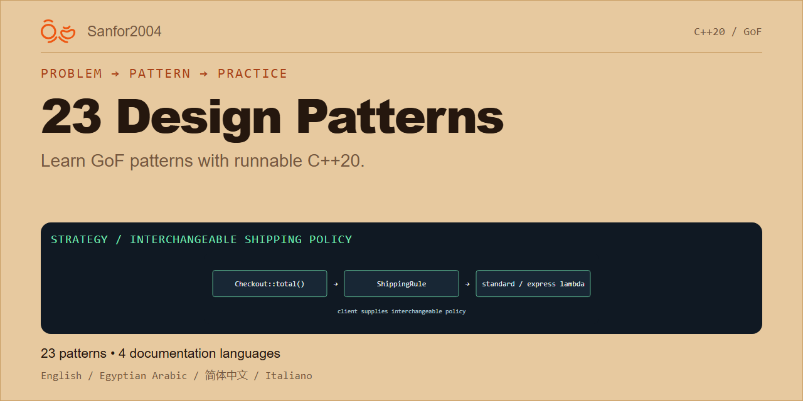

# 23 Design Patterns — launch pack

Prepared 2026-09-12 from `C:/www/Design-Patterns-23`, base revision `0fd233e` plus the current working tree. Existing Arabic documentation edits were preserved. Display name: **23 Design Patterns**. The configured repository URL remains `https://github.com/sanfor2004/Design-Patterns-23`.

Complete local delivery: 12 post packages (including a full article, four-part thread, and two follow-up lengths), 10 campaign PNGs, editable compositions, and a seven-day plan. Nothing has been posted, scheduled, pushed, or applied to GitHub settings.

- [Finished posts](posts.md)
- [Project brief and evidence](project-brief.md)
- [Seven-day launch plan](launch-plan.md)
- [Images, alt text, reproduction, and GitHub upload](assets.md)
- [Keyword and SEO tracker](keyword-tracking.md)
- [Measurement sheet](metrics.csv)
- [Validation and limitations](validation.md)
- [Rendering source](source/render.cjs)
- [Image dimensions and byte sizes](source/image-validation.json)
- [Reusable framework](../social_media_launch_framework.md)

Start with LI-01 and the landscape image. Community destinations and account settings still need their publishing-time checks. The GitHub picture is ready to upload; its setting has not been applied. Keyword metrics begin empty because no launch observations are available.
