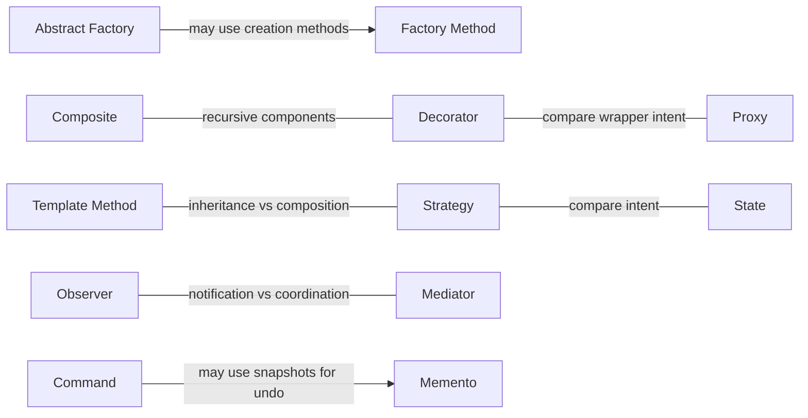

# خريطة العلاقات

[دليل الأنماط](README.ar-EG.md)

دي علاقات مفيدة، مش اعتماديات إجبارية. السهم بيشرح احتمال تصميم، مش شرط تستخدم النمطين مع بعض.

- [المصنع المجرّد](creational/abstract-factory/README.ar-EG.md) → ممكن تنفّذ الإنشاء باستخدام → [طريقة المصنع](creational/factory-method/README.ar-EG.md)
- [الحالة](behavioral/state/README.ar-EG.md) → شبهها في تركيب التفويض → [الاستراتيجية](behavioral/strategy/README.ar-EG.md)
- [المزيّن](structural/decorator/README.ar-EG.md) → بتشاركها تركيب المكونات المتكرر → [المركّب](structural/composite/README.ar-EG.md)
- [الوكيل](structural/proxy/README.ar-EG.md) → ممكن تشبه تركيب التغليف بتاع → [المزيّن](structural/decorator/README.ar-EG.md)
- [طريقة القالب](behavioral/template-method/README.ar-EG.md) → بديل بالوراثة لفكرة → [الاستراتيجية](behavioral/strategy/README.ar-EG.md)
- [الأمر](behavioral/command/README.ar-EG.md) → ممكن تستخدم نسخة للتراجع من → [التذكار](behavioral/memento/README.ar-EG.md)

- [Observer](behavioral/observer/README.ar-EG.md) ↔ قارن الإشعار بالتنسيق ↔ [Mediator](behavioral/mediator/README.ar-EG.md)

