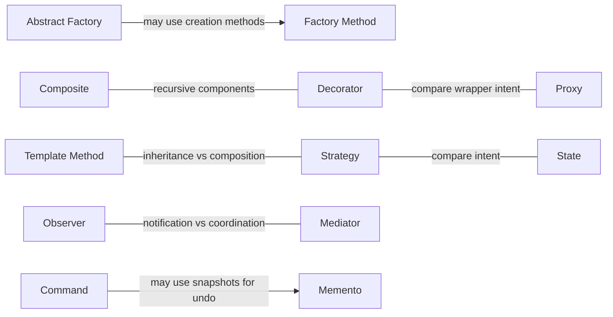

# خريطة العلاقات

[دليل الأنماط](README.ar-EG.md)

دي علاقات مفيدة، مش اعتماديات إجبارية. السهم بيشرح احتمال تصميم، مش شرط تستخدم النمطين مع بعض.

- ممكن [`Abstract Factory`](creational/abstract-factory/README.ar-EG.md) تستخدم [`Factory Method`](creational/factory-method/README.ar-EG.md) في خطوات الإنشاء.
- فيه تشابه في تركيب التفويض (`delegation`) بين [`State`](behavioral/state/README.ar-EG.md) و[`Strategy`](behavioral/strategy/README.ar-EG.md)، لكن هدف كل نمط مختلف.
- فيه تركيب متكرر للمكونات في كل من [`Decorator`](structural/decorator/README.ar-EG.md) و[`Composite`](structural/composite/README.ar-EG.md).
- ممكن شكل طبقة التغليف في [`Proxy`](structural/proxy/README.ar-EG.md) يشبه [`Decorator`](structural/decorator/README.ar-EG.md)، لكن الأولى بتنظم الوصول والتانية بتضيف سلوك.
- قارن التوسعة بالوراثة (`inheritance`) في [`Template Method`](behavioral/template-method/README.ar-EG.md) بالتركيب (`composition`) في [`Strategy`](behavioral/strategy/README.ar-EG.md).
- ممكن [`Command`](behavioral/command/README.ar-EG.md) تستخدم نسخة محفوظة بنمط [`Memento`](behavioral/memento/README.ar-EG.md) عشان تدعم التراجع.
- قارن الإشعار في [`Observer`](behavioral/observer/README.ar-EG.md) بالتنسيق في [`Mediator`](behavioral/mediator/README.ar-EG.md).

