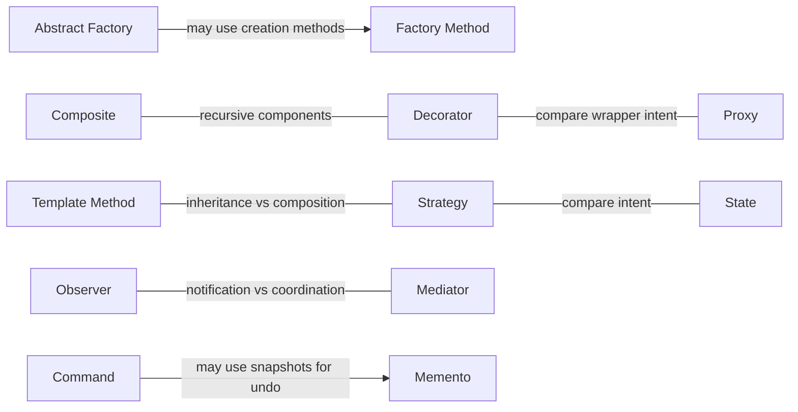

# Mappa delle relazioni

[Catalogo dei pattern](README.it.md)

Sono relazioni utili, non dependency obbligatorie. Una freccia descrive una possibilità progettuale, non l'obbligo di usare entrambi i pattern.

- [Abstract Factory](creational/abstract-factory/README.it.md) → può implementare la creazione tramite → [Factory Method](creational/factory-method/README.it.md)
- [State](behavioral/state/README.it.md) → ha una delega simile a → [Strategy](behavioral/strategy/README.it.md)
- [Decorator](structural/decorator/README.it.md) → condivide la struttura ricorsiva con → [Composite](structural/composite/README.it.md)
- [Proxy](structural/proxy/README.it.md) → può avere un wrapper simile a → [Decorator](structural/decorator/README.it.md)
- [Template Method](behavioral/template-method/README.it.md) → offre un’alternativa basata su inheritance a → [Strategy](behavioral/strategy/README.it.md)
- [Command](behavioral/command/README.it.md) → può usare uno snapshot per annullare tramite → [Memento](behavioral/memento/README.it.md)

- [Observer](behavioral/observer/README.it.md) ↔ Confronta notifica e coordinamento ↔ [Mediator](behavioral/mediator/README.it.md)

