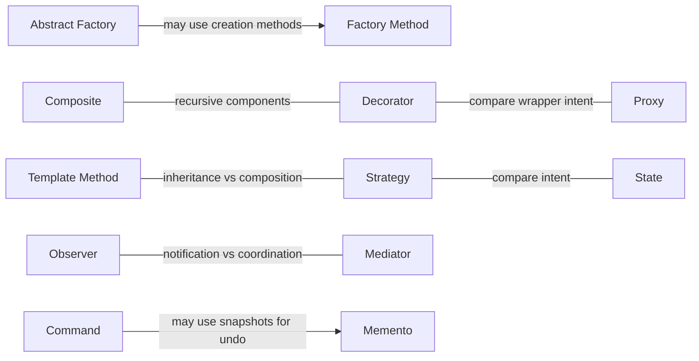

# Mappa delle relazioni

[Catalogo dei pattern](README.it.md)

Sono relazioni utili, non dipendenze obbligatorie. Una freccia descrive una possibilità progettuale, non l'obbligo di usare entrambi i pattern.

- [Fabbrica astratta](creational/abstract-factory/README.it.md) → può implementare la creazione tramite → [Metodo fabbrica](creational/factory-method/README.it.md)
- [Stato](behavioral/state/README.it.md) → ha una delega simile a → [Strategia](behavioral/strategy/README.it.md)
- [Decoratore](structural/decorator/README.it.md) → condivide la struttura ricorsiva con → [Composito](structural/composite/README.it.md)
- [Procuratore](structural/proxy/README.it.md) → può avere un wrapper simile a → [Decoratore](structural/decorator/README.it.md)
- [Metodo modello](behavioral/template-method/README.it.md) → offre un’alternativa basata su ereditarietà a → [Strategia](behavioral/strategy/README.it.md)
- [Comando](behavioral/command/README.it.md) → può usare uno snapshot per annullare tramite → [Promemoria](behavioral/memento/README.it.md)

- [Observer](behavioral/observer/README.it.md) ↔ Confronta notifica e coordinamento ↔ [Mediator](behavioral/mediator/README.it.md)

