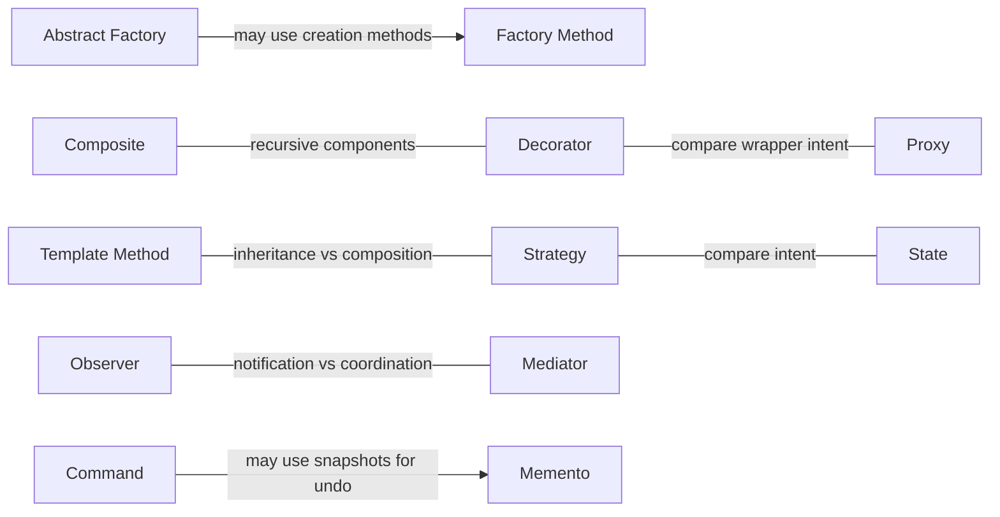

# Relationship map

[Pattern catalog](README.md)

These are useful relationships, not mandatory dependencies. An arrow describes one design possibility; it does not require using both patterns.

- [Abstract Factory](creational/abstract-factory/README.md) → can implement creation using → [Factory Method](creational/factory-method/README.md)
- [State](behavioral/state/README.md) → resembles delegation structure of → [Strategy](behavioral/strategy/README.md)
- [Decorator](structural/decorator/README.md) → shares recursive component structure with → [Composite](structural/composite/README.md)
- [Proxy](structural/proxy/README.md) → can resemble the wrapper structure of → [Decorator](structural/decorator/README.md)
- [Template Method](behavioral/template-method/README.md) → offers an inheritance alternative to → [Strategy](behavioral/strategy/README.md)
- [Command](behavioral/command/README.md) → can use a snapshot for undo from → [Memento](behavioral/memento/README.md)

- [Observer](behavioral/observer/README.md) ↔ Compare notification with coordination ↔ [Mediator](behavioral/mediator/README.md)

