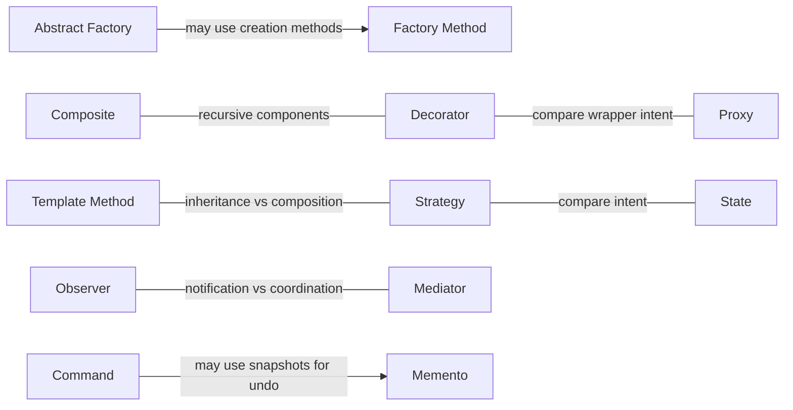

# 关系图

[模式目录](README.zh-CN.md)

这些是可用的关系，不是强制依赖。箭头表示一种设计可能，并不要求同时使用两个模式。

- [Abstract Factory](creational/abstract-factory/README.zh-CN.md) → 可用来实现创建操作 → [Factory Method](creational/factory-method/README.zh-CN.md)
- [State](behavioral/state/README.zh-CN.md) → 委托结构相似 → [Strategy](behavioral/strategy/README.zh-CN.md)
- [Decorator](structural/decorator/README.zh-CN.md) → 共享 recursive 组件结构 → [Composite](structural/composite/README.zh-CN.md)
- [Proxy](structural/proxy/README.zh-CN.md) → 包装结构可能相似 → [Decorator](structural/decorator/README.zh-CN.md)
- [Template Method](behavioral/template-method/README.zh-CN.md) → 提供基于 inheritance 的替代思路 → [Strategy](behavioral/strategy/README.zh-CN.md)
- [Command](behavioral/command/README.zh-CN.md) → 可借助 snapshot 实现撤销 → [Memento](behavioral/memento/README.zh-CN.md)

- [Observer](behavioral/observer/README.zh-CN.md) ↔ 比较通知与协调 ↔ [Mediator](behavioral/mediator/README.zh-CN.md)

