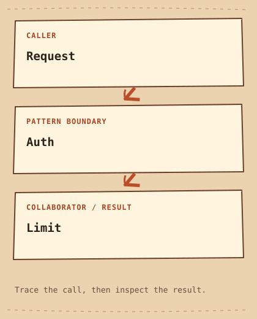

# Chain of Responsibility

[English](README.md) · [مصري](README.ar-EG.md) · [خطة التعلّم](../../LEARNING_PATH.ar-EG.md) · [Python](python/main.py) · [C++20](cpp/main.cpp)

**الفكرة في سطر:** مرّر الطلب على سلسلة معالجات (`Handlers`)؛ كل واحدة تقدر توقفه أو تمرّره للي بعدها.

## المشكلة

الطلب لازم يعدّي فحص الهوية وحد الإنفاق، وكل مدخل ممكن يحتاج سياسة مختلفة. شرط واحد كويس في الأول؛ نسخه وتعديله لكذا مسار بيصعّب إعادة الاستخدام وترتيب السياسات.

## الحل ببساطة

الطلب لازم يعدّي فحص الهوية وحدّ المبلغ.كل `Handler` مسؤول عن فحص واحد، والمستدعي بيختار ترتيب السلسلة. خلّي كل معالج (`Handler`) يعمل فحصه، ويمرّر الطلب للي بعده بس لو الفحص نجح. في المثال ده، الطلب بيتقبل بعد نجاح كل الفحوصات.

الـ **interface** هو الاتفاق اللي الكود المستدعي متوقعه: هيستدعي إيه، وإيه النتيجة. المثال بيحط المسؤولية دي في مكان واضح بدل ما تتكرر في كل مكان.

## اقرأ الرسمة



```text
Request  -->  Auth  -->  Limit
```

في المثال، كل `Handler` بتمتلك اللي بعدها. فحص الهوية موجود في `Auth`، وفحص المبلغ في `Limit`. المستدعي (`Client`) بيختار ترتيب السلسلة.

الأدوار القياسية في المثال ده:

- [`Handler`](../../GLOSSARY.md#handler) — دور بيعمل معالجة للطلب أو يبعته للي بعده. هنا: `Handler`.
- [`Concrete Handler`](../../GLOSSARY.md#concrete-handler) — معالج (`Handler`) بينفّذ قاعدة معينة. هنا: `Auth, Limit`.
- [`chain termination`](../../GLOSSARY.md#chain-termination) — القاعدة اللي بتحدد السلسلة تقف إمتى وإيه يحصل بعد آخر `Handler`. هنا: `Handler::handle`.

الأسهم بتوضح مسار المثال ده، مش كل تطبيق ممكن للـ pattern. [شرح الرسمة](diagram.md).

## امشِ مع الكود

ابدأ من `main` في C++ أو من آخر جزء في Python. تابع الدور اللي في نص الرسمة، وبعدين شوف الناتج. الكود الكامل موجود كمان في [ملف Python](python/main.py) و[ملف C++20](cpp/main.cpp).

## Python example

```python
class Request:
    def __init__(self, authenticated, amount_cents):
        self.authenticated = authenticated
        self.amount_cents = amount_cents


class Handler:
    def __init__(self, next_handler=None):
        self.next_handler = next_handler

    def accepts(self, request):
        raise NotImplementedError

    def handle(self, request):
        if not self.accepts(request):
            return False
        if self.next_handler is None:
            return True
        return self.next_handler.handle(request)


class Auth(Handler):
    def accepts(self, request):
        return request.authenticated


class Limit(Handler):
    def accepts(self, request):
        return 0 < request.amount_cents <= 10000


if __name__ == "__main__":
    chain = Auth(Limit())
    for authenticated, amount_cents in [(False, 2000), (True, 20000),
                                       (True, 2000), (True, 0), (True, 10000)]:
        request = Request(authenticated, amount_cents)
        print("Accepted" if chain.handle(request) else "Rejected")
```

### Python output

```text
Rejected
Rejected
Accepted
Rejected
Accepted
```

## C++20 example

```cpp
// Monetary amounts in this example are integer cents.
#include <initializer_list>
#include <iostream>
#include <memory>
#include <utility>

struct Request { bool authenticated; int amount_cents; };
class Handler {
    std::unique_ptr<Handler> next_;
protected:
    virtual bool accepts(const Request& request) const = 0;
public:
    explicit Handler(std::unique_ptr<Handler> next = {}) : next_(std::move(next)) {}
    virtual ~Handler() = default;
    bool handle(const Request& request) const {
        if (!accepts(request)) return false;
        return next_ ? next_->handle(request) : true;
    }
};
class Auth final : public Handler {
    bool accepts(const Request& request) const override { return request.authenticated; }
public:
    using Handler::Handler;
};
class Limit final : public Handler {
    bool accepts(const Request& request) const override { return request.amount_cents > 0 && request.amount_cents <= 100; }
public:
    using Handler::Handler;
};
int main() {
    const Auth chain{std::make_unique<Limit>()};
    for (const auto& request : {Request{false, 20}, Request{true, 200}, Request{true, 20}})
        std::cout << (chain.handle(request) ? "Accepted" : "Rejected") << '\n';
}
```

### C++20 output

```text
Rejected
Rejected
Accepted
```

## قارن اللغتين

Both versions use a validation chain: each Handler may reject, or pass onward; reaching the end means success. Other chains stop at the first Handler that can fulfill a request. Python holds successor references; C++ owns them with `unique_ptr`.

الفكرة واحدة في المثالين، حتى لو تفاصيل اللغة والناتج اختلفت. اقرأ الناتجين قبل ما تغيّر أي قيمة.

## إمتى تستخدمه؟

استخدمه لما ترتيب الفحوصات أو اختيارها محتاج تركيب مستقل.

### Use cases

مناسب للـ `Validation` والـ `Middleware`. النسخة دي بتطلب موافقة الكل، مش أول `Handler` ناجحة بس.

**التكلفة:** الترتيب بيأثر، ولازم سياسة واضحة لنهاية السلسلة. هنا بنقبل بعد نجاح الكل؛ سلاسل تانية ممكن ترفض الطلب غير المعالج.

## جرّب تجاوب

1. الوصول لنهاية السلسلة هنا معناه إيه، وإمتى الفحص بيوقفها؟
2. إمتى الحل البسيط في الصفحة يبقى أسهل في الصيانة؟ ادّي مثال محدد.
3. غيّر مُدخل واحد في مثال Python. توقّع الناتج واشرح أنهي جزء مسؤول عن التغيير.

**تجربة صغيرة:** ضيف فحص وضع الصيانة، واتأكد إن المرفوض ما يوصلش للفحوصات اللي بعده.

[كل الأنماط](../../README.ar-EG.md) · [المصطلحات](../../GLOSSARY.md) · [دليل Python](../../PYTHON_EXAMPLES.md) · [دليل C++20](../../CPP_EXAMPLES.md)
