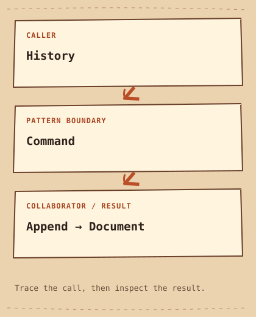

# Command

[English](README.md) · [مصري](README.ar-EG.md) · [中文](README.zh-CN.md) · [Italiano](README.it.md)

[Precedente](../../behavioral/chain-of-responsibility/README.it.md) · [Categoria](../README.it.md) · [Successivo](../../behavioral/interpreter/README.it.md)

[Percorso di studio](../../LEARNING_PATH.it.md) · [Scheda rapida](../../CHEATSHEET.it.md) · [Python](python/README.md) · [C++20](cpp/README.md)

## Category

[`Behavioral Pattern`](../../GLOSSARY.md#behavioral-pattern) — Un Design Pattern che organizza behavior e collaborazione fra object.

## Difficulty

Intermedio

## In One Sentence

Trasforma un'azione in un object conservabile e invocabile in seguito.

## In parole semplici

Un editor deve ricordare le modifiche per annullarle.Command conserva azione e dati per annullarla, mentre History decide quando eseguire o annullare.

## The Problem

Un editor deve applicare e annullare modifiche senza insegnare ogni operazione alla barra degli strumenti.

## Naive Solution

```cpp
document.text += " world"; // no object records how to undo
```

## Why It Becomes a Problem

La modifica diretta non registra né l'azione né lo state precedente.

## The Idea

Append cattura destinatario e argomento; execute salva il testo precedente, undo lo ripristina. History possiede i comandi.

## Real-World Analogy

La comanda del ristorante conserva l'azione separatamente dal cameriere.

## Structure

[Diagramma](diagram.md) · [Esegui l’esempio](cpp/README.md)



```text
History  -->  Command  -->  Append → Document
```

## Participants

Command definisce execute e undo, Append modifica un Document non posseduto, History conserva i comandi come stack.

Ruoli canonici in questo esempio:

- [`Receiver`](../../GLOSSARY.md#receiver) — L'object che svolge il lavoro richiesto da un Command. Qui: `Document`.
- [`Invoker`](../../GLOSSARY.md#invoker) — Il ruolo che avvia o conserva Command senza conoscere i dettagli delle singole operazioni. Qui: `History`.
- [`Concrete Command`](../../GLOSSARY.md#concrete-command) — Un'implementation di Command che collega un Receiver a un'azione. Qui: `Append`.

## Python Example

Leggi prima il [piccolo esempio Python](python/README.md) e il [codice](python/main.py). Prevedi l’[output](python/expected.txt), poi esegui e modifica. Le note in inglese confrontano il progetto con C++20.

## Modern C++20 Example

```cpp
#include <iostream>
#include <memory>
#include <stdexcept>
#include <string>
#include <utility>
#include <vector>

struct Document { std::string text; };
struct Command {
    virtual ~Command() = default;
    virtual void execute() = 0;
    virtual void undo() = 0;
};
class Append final : public Command {
    Document& document_;
    std::string suffix_;
    std::string before_;
public:
    Append(Document& document, std::string suffix) : document_(document), suffix_(std::move(suffix)) {}
    void execute() override { before_ = document_.text; document_.text += suffix_; }
    void undo() override { document_.text = before_; }
};
class History {
    std::vector<std::unique_ptr<Command>> commands_;
public:
    void run(std::unique_ptr<Command> command) {
        if (!command) throw std::invalid_argument("Missing command");
        commands_.push_back(std::move(command));
        try { commands_.back()->execute(); }
        catch (...) { commands_.pop_back(); throw; }
    }
    void undo() {
        if (commands_.empty()) return;
        commands_.back()->undo();
        commands_.pop_back();
    }
};
int main() {
    Document document{"Hello"};
    History history;
    history.run(std::make_unique<Append>(document, " world"));
    std::cout << document.text << '\n';
    history.undo();
    std::cout << document.text << '\n';
    history.undo();
    std::cout << "Empty undo: " << document.text << '\n';
}
```

## Example Output

```text
Hello world
Hello
Empty undo: Hello
```

## When to Use

Usalo per azioni differite, code, macro e annullamento.

### Use cases

Azioni di editor e code di job; una coda durevole richiede anche serialization e idempotency.

## When NOT to Use

Evitalo per una chiamata isolata senza necessità di memorizzare o pianificare l'intento.

## Advantages

L'Invoker resta indipendente dalle operazioni concrete e ne conserva la storia.

## Trade-offs

Salvare tutto il testo costa memoria. Il demo a thread singolo presume modifiche tramite History e un Document più longevo; modifiche esterne rompono l'annullamento atteso.

## Related Patterns

[Memento](../memento/README.it.md) · [Chain of Responsibility](../chain-of-responsibility/README.it.md)

## Common Confusion

Memento conserva state, Command conserva un'azione e può usare uno snapshot. Non ogni comando è reversibile.

## Terms to Remember

- `Command` — Trasforma un'azione in un object conservabile e invocabile in seguito.
- `Receiver` — L'object che svolge il lavoro richiesto da un Command. Esempio: `Document`.
- `Invoker` — Il ruolo che avvia o conserva Command senza conoscere i dettagli delle singole operazioni. Esempio: `History`.
- `Concrete Command` — Un'implementation di Command che collega un Receiver a un'azione. Esempio: `Append`.

## Interview Vocabulary

- [`undo`](../../GLOSSARY.md#undo) — Ripristinare un risultato precedente con state salvato o un'operazione inversa, quando possibile.
- [`encapsulation`](../../GLOSSARY.md#encapsulation) — Proteggere rappresentazione interna e invarianti mediante operazioni controllate.
- [`exception safety`](../../GLOSSARY.md#exception-safety) — Le garanzie mantenute da un'operazione quando fallisce lanciando un'exception.

## Interview Question

Inviare un'email è annullabile come ripristinare una stringa? Distingui compensazione e inversione.

## Mini Challenge

Esegui due append, annulla due volte e verifica che annullare una storia vuota sia innocuo.

## Verifica cosa hai capito

1. Perché queste modifiche vanno annullate in ordine inverso?
2. Quando sarebbe più facile mantenere la soluzione semplice della pagina? Fai un esempio concreto.
3. Cambia un input dell’esempio Python. Prevedi l’output e spiega quale parte gestisce il cambiamento.

## Quick Summary

- **Problema:** Un editor deve applicare e annullare modifiche senza insegnare ogni operazione alla barra degli strumenti.
- **Soluzione:** Append cattura destinatario e argomento; execute salva il testo precedente, undo lo ripristina. History possiede i comandi.
- **Trade-off:** Salvare tutto il testo costa memoria. Il demo a thread singolo presume modifiche tramite History e un Document più longevo; modifiche esterne rompono l'annullamento atteso.
- **Da ricordare:** Un'azione da conservare.

[Precedente](../../behavioral/chain-of-responsibility/README.it.md) · [Categoria](../README.it.md) · [Successivo](../../behavioral/interpreter/README.it.md)
