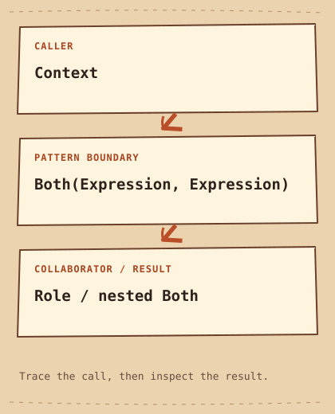

# Interprete

[English](README.md) · [مصري](README.ar-EG.md) · [中文](README.zh-CN.md) · [Italiano](README.it.md)

[Precedente](../../behavioral/command/README.it.md) · [Categoria](../README.it.md) · [Successivo](../../behavioral/iterator/README.it.md)

## Categoria

Comportamentali

## Difficoltà

Avanzato

## In una frase

Rappresenta un piccolo linguaggio con oggetti che valutano le regole grammaticali.

## Il problema

Le regole combinano ruoli e congiunzioni e devono essere costruibili come dati.

## Soluzione iniziale

```cpp
bool allowed = roles.contains("editor") && roles.contains("verified");
```

## Perché diventa difficile

Una condizione fissa è semplice, ma cambiare regole annidate richiede modifiche all'applicazione.

## Idea centrale

Role è un terminale; Both è un non terminale che valuta due figli con AND a cortocircuito.

## Analogia quotidiana

Una frase combina parole secondo una grammatica; una regola combina ruoli con AND.

## Diagramma originale

[Diagramma](diagram.md) · [Esegui l’esempio](cpp/README.md)



```text
Context  -->  Both(Expression, Expression)  -->  Role / nested Both
```

## Partecipanti

Expression definisce la valutazione, Context fornisce ruoli, Role verifica appartenenza, Both possiede i figli.

## C++20 moderno — esempio eseguibile completo

```cpp
#include <iostream>
#include <memory>
#include <stdexcept>
#include <string>
#include <unordered_set>
#include <utility>

using Context = std::unordered_set<std::string>;
struct Expression {
    virtual ~Expression() = default;
    virtual bool evaluate(const Context& context) const = 0;
};
class Role final : public Expression {
    std::string name_;
public:
    explicit Role(std::string name) : name_(std::move(name)) {}
    bool evaluate(const Context& context) const override { return context.contains(name_); }
};
class Both final : public Expression {
    std::unique_ptr<Expression> left_, right_;
public:
    Both(std::unique_ptr<Expression> left, std::unique_ptr<Expression> right)
        : left_(std::move(left)), right_(std::move(right)) {
        if (!left_ || !right_) throw std::invalid_argument("Missing expression");
    }
    bool evaluate(const Context& context) const override {
        return left_->evaluate(context) && right_->evaluate(context);
    }
};
int main() {
    const Both rule{std::make_unique<Role>("editor"), std::make_unique<Role>("verified")};
    std::cout << std::boolalpha << rule.evaluate(Context{"editor"}) << '\n';
    std::cout << rule.evaluate(Context{"editor", "verified"}) << '\n';
}
```

## Output previsto

```text
false
true
```

## Quando usarlo

Usalo per grammatiche piccole e stabili con un albero utile da costruire e ispezionare.

## Quando NON usarlo

Evitalo per linguaggi grandi che richiedono parsing robusto, diagnostica e ottimizzazione.

## Vantaggi

Le regole si compongono ricorsivamente e si valutano su contesti diversi.

## Svantaggi e compromessi

Ogni forma grammaticale aggiunge codice; alberi profondi rischiano lo stack. Non c'è parser: main costruisce direttamente l'albero.

## Applicazioni tecniche

Piccoli linguaggi di filtro o idoneità; non è un sistema sicuro di autorizzazione né un parser generale.

## Pattern correlati

[composite](../../structural/composite/README.it.md) · [visitor](../visitor/README.it.md)

## Confusione comune

Composite descrive l'albero, Interpreter aggiunge semantica e valutazione. Visitor può aggiungere altre operazioni.

## Domanda da colloquio

Dove gestiresti la precedenza nell'input editor AND verified OR admin?

## Piccola sfida

Aggiungi Either per OR e prova una regola annidata su tre contesti.

## Riepilogo

- **Problema:** Le regole combinano ruoli e congiunzioni e devono essere costruibili come dati.
- **Soluzione:** Role è un terminale; Both è un non terminale che valuta due figli con AND a cortocircuito.
- **Compromesso:** Ogni forma grammaticale aggiunge codice; alberi profondi rischiano lo stack. Non c'è parser: main costruisce direttamente l'albero.
- **Da ricordare:** I nodi grammaticali danno significato.

[Precedente](../../behavioral/command/README.it.md) · [Categoria](../README.it.md) · [Successivo](../../behavioral/iterator/README.it.md)
