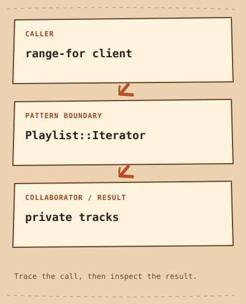

# Iterator: example map

[English lesson](README.md) · [الشرح بالمصري](README.ar-EG.md) · [Python source](python/main.py) · [C++20 source](cpp/main.cpp)



```text
range-for client  -->  Playlist::Iterator  -->  private tracks
```

Playlist owns tracks; Iterator borrows the vector and stores a position. Range-for is the client. A static_assert checks the C++20 forward_iterator concept.

The sketch maps the example's call path. The middle card is where the pattern assigns or changes responsibility; arrows show the demonstrated flow, not inheritance or object ownership.
