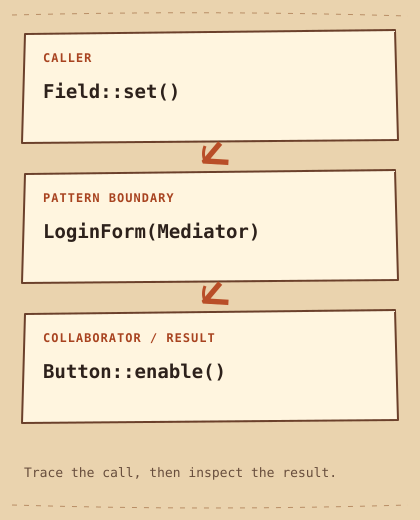

# Mediatore

[English](README.md) · [مصري](README.ar-EG.md) · [中文](README.zh-CN.md) · [Italiano](README.it.md)

[Precedente](../../behavioral/iterator/README.it.md) · [Categoria](../README.it.md) · [Successivo](../../behavioral/memento/README.it.md)

## Categoria

Comportamentali

## Difficoltà

Intermedio

## In una frase

Sposta la coordinazione fra oggetti pari in un oggetto dedicato.

## Il problema

Username e password determinano insieme se il pulsante di accesso è attivo.

## Soluzione iniziale

```cpp
// Each field directly updates the button and reads its sibling.
submit.enable(!username.empty() && !password.empty());
```

## Perché diventa difficile

Se ogni campo conosce l'altro e il pulsante, le regole si disperdono e le dipendenze si intrecciano.

## Idea centrale

I campi notificano changed a LoginForm, che verifica i valori e aggiorna il pulsante.

## Analogia quotidiana

Il controllo aereo coordina le interazioni senza negoziazioni fra ogni coppia di piloti.

## Diagramma originale

[Diagramma](diagram.md) · [Esegui l’esempio](cpp/README.md)



```text
Field::set()  -->  LoginForm(Mediator)  -->  Button::enable()
```

## Partecipanti

Mediator definisce le notifiche, Field le invia, Button conserva lo stato, LoginForm possiede e coordina i colleghi.

## C++20 moderno — esempio eseguibile completo

```cpp
#include <iostream>
#include <string>
#include <string_view>
#include <utility>

struct Mediator {
    virtual ~Mediator() = default;
    virtual void changed() = 0;
};
class Field {
    Mediator& mediator_;
    std::string value_;
public:
    explicit Field(Mediator& mediator) : mediator_(mediator) {}
    void set(std::string value) { value_ = std::move(value); mediator_.changed(); }
    bool empty() const { return value_.empty(); }
};
class Button {
    bool enabled_ = false;
public:
    void enable(bool enabled) { enabled_ = enabled; }
    bool enabled() const { return enabled_; }
};
class LoginForm final : public Mediator {
    Field username_;
    Field password_;
    Button submit_;
public:
    LoginForm() : username_(*this), password_(*this) {}
    LoginForm(const LoginForm&) = delete;
    LoginForm& operator=(const LoginForm&) = delete;
    void changed() override { submit_.enable(!username_.empty() && !password_.empty()); }
    void username(std::string value) { username_.set(std::move(value)); }
    void password(std::string value) { password_.set(std::move(value)); }
    bool ready() const { return submit_.enabled(); }
};
int main() {
    LoginForm form;
    form.username("learner");
    std::cout << "Ready: " << std::boolalpha << form.ready() << '\n';
    form.password("example");
    std::cout << "Ready: " << form.ready() << '\n';
}
```

## Output previsto

```text
Ready: false
Ready: true
```

## Quando usarlo

Usalo quando le interazioni fra più pari diventano intricate.

## Quando NON usarlo

Evitalo per un semplice callback o in assenza di regole di coordinazione.

## Vantaggi

I campi non conoscono fratelli o pulsante e la regola vive in un punto.

## Svantaggi e compromessi

Il mediatore può ingrandirsi troppo. LoginForm non è copiabile: i campi conservano riferimenti al form e una copia avrebbe collegamenti sbagliati.

## Applicazioni tecniche

Dialoghi e controllori di flusso; abilitare un pulsante non autentica né valida password.

## Pattern correlati

[observer](../observer/README.it.md) · [facade](../../structural/facade/README.it.md)

## Confusione comune

Observer diffonde cambiamenti; Mediator stabilisce come specifici colleghi collaborano e può usare Observer per le notifiche.

## Domanda da colloquio

Perché un costruttore di copia automatico sarebbe pericoloso per LoginForm?

## Piccola sfida

Aggiungi l'accettazione dei termini senza far conoscere il pulsante a Field.

## Riepilogo

- **Problema:** Username e password determinano insieme se il pulsante di accesso è attivo.
- **Soluzione:** I campi notificano changed a LoginForm, che verifica i valori e aggiorna il pulsante.
- **Compromesso:** Il mediatore può ingrandirsi troppo. LoginForm non è copiabile: i campi conservano riferimenti al form e una copia avrebbe collegamenti sbagliati.
- **Da ricordare:** I colleghi passano dal coordinatore.

[Precedente](../../behavioral/iterator/README.it.md) · [Categoria](../README.it.md) · [Successivo](../../behavioral/memento/README.it.md)
