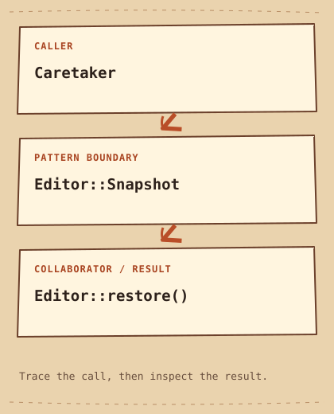

# Memento

[English](README.md) · [مصري](README.ar-EG.md) · [Learning path](../../LEARNING_PATH.md) · [Python](python/main.py) · [C++20](cpp/main.cpp)

**In one sentence:** Save State now and restore it later.

## The problem

An editor needs a checkpoint before an experimental edit. If the undo manager copies public fields itself, every new internal field requires changes in the manager.

## The idea

An editor needs a checkpoint before a risky edit. Memento holds that checkpoint while the editor controls how its state is saved and restored. Editor creates a Snapshot with private text and later reads it to restore itself.

An **interface** is the behavior a caller expects. The example gives that behavior a clear owner instead of spreading the decision through callers.

## Trace the sketch



```text
Caretaker  -->  Editor::Snapshot  -->  Editor::restore()
```

Editor is the originator. Snapshot is the memento with private state. main is the caretaker holding it without inspecting its contents. The arrows follow this example's calls, not every possible implementation of the pattern. [Open the diagram notes](diagram.md).

## Read the code

Editor is the originator. Snapshot is the memento with private state. main is the caretaker holding it without inspecting its contents.

Canonical roles in this example:

- [`Originator`](../../GLOSSARY.md#originator) — The object that knows how to capture and restore its own state. Here: `Editor`.
- [`Caretaker`](../../GLOSSARY.md#caretaker) — The role that keeps a Memento without inspecting its private representation. Here: `main`.
- [`snapshot`](../../GLOSSARY.md#snapshot) — A captured representation of selected state at a point in time. Here: `Editor::Snapshot`.

Start at the call in `main` or the Python `if __name__ == "__main__"` block. Follow the middle role in the sketch, then compare the printed result. The full sources below are also in [python/main.py](python/main.py) and [cpp/main.cpp](cpp/main.cpp).

## Python example

```python
class Snapshot:
    def __init__(self, text):
        self._text = text


class Editor:
    def __init__(self):
        self.text = ""

    def write(self, text):
        self.text = text

    def save(self):
        return Snapshot(self.text)

    def restore(self, snapshot):
        self.text = snapshot._text


if __name__ == "__main__":
    editor = Editor()
    editor.write("Draft")
    checkpoint = editor.save()
    editor.write("Broken edit")
    print(editor.text)
    editor.restore(checkpoint)
    print(editor.text)
    editor.write("Another edit")
    editor.restore(checkpoint)
    print(editor.text)
```

### Python output

```text
Broken edit
Draft
Draft
```

## C++20 example

```cpp
#include <iostream>
#include <string>
#include <utility>

class Editor {
    std::string text_;
public:
    class Snapshot {
        friend class Editor;
        std::string text_;
        explicit Snapshot(std::string text) : text_(std::move(text)) {}
    };
    void write(std::string text) { text_ = std::move(text); }
    Snapshot save() const { return Snapshot{text_}; }
    void restore(const Snapshot& snapshot) { text_ = snapshot.text_; }
    const std::string& text() const { return text_; }
};
int main() {
    Editor editor;
    editor.write("Draft");
    const auto checkpoint = editor.save();
    editor.write("Broken edit");
    std::cout << editor.text() << '\n';
    editor.restore(checkpoint);
    std::cout << editor.text() << '\n';
    editor.write("Another edit");
    editor.restore(checkpoint);
    std::cout << "Restore again: " << editor.text() << '\n';
}
```

### C++20 output

```text
Broken edit
Draft
Restore again: Draft
```

## Compare the languages

Python uses an underscore to mark snapshot details as internal by convention. C++ enforces private access with a friend declaration. Both snapshots hold immutable text values here. Mutable nested State would require an explicit copy policy; neither snapshot reverses external side effects.

Both examples assign the same pattern responsibility, although their output or setup may differ. Compare the two expected-output blocks before changing an input.

## When it helps

Use it for checkpoints where the originator can define a consistent state snapshot.

### Use cases

Editor checkpoints and simulation snapshots fit when the saved state is complete and consistent.

**Cost:** Full snapshots cost memory and copying time. External effects such as files or network calls are not undone by restoring this string.

## Check yourself

1. Why must later edits leave a saved Snapshot unchanged?
2. When would the naive solution on this page be easier to maintain? Give a concrete example.
3. Change one input in the Python example. Predict the output and explain which responsibility handles the change.

Try this change: Include a cursor position in Snapshot and test that both text and cursor return together.

[All patterns](../../README.md) · [Glossary](../../GLOSSARY.md) · [C++20 build guide](../../CPP_EXAMPLES.md) · [Python guide](../../PYTHON_EXAMPLES.md)
