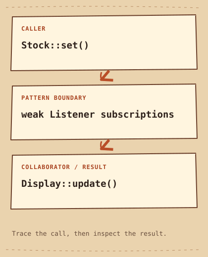

# Observer

[English](README.md) · [مصري](README.ar-EG.md) · [中文](README.zh-CN.md) · [Italiano](README.it.md)

[Precedente](../../behavioral/memento/README.it.md) · [Categoria](../README.it.md) · [Successivo](../../behavioral/state/README.it.md)

[Percorso di studio](../../LEARNING_PATH.it.md) · [Scheda rapida](../../CHEATSHEET.it.md) · [Python](python/README.md) · [C++20](cpp/README.md)

## Category

[`Behavioral Pattern`](../../GLOSSARY.md#behavioral-pattern) — Un Design Pattern che organizza behavior e collaborazione fra object.

## Difficulty

Principiante

## In One Sentence

Notifica gli object iscritti quando cambia ciò che seguono.

## In parole semplici

Più display possono richiedere la quantità aggiornata in magazzino.Observer permette l’iscrizione, evitando a Stock una chiamata fissa per ogni display.

## The Problem

Il magazzino deve aggiornare le viste interessate senza conoscere ogni concrete type.

## Naive Solution

```cpp
display.update(quantity);
email.update(quantity); // publisher names every consumer
```

## Why It Becomes a Problem

Chiamare direttamente ogni consumatore lega il publisher all'elenco e impone modifiche a ogni aggiunta.

## The Idea

Stock conserva weak reference a Listener e notifica quelli ancora vivi.

## Real-World Analogy

Gli iscritti ricevono avvisi di disponibilità finché la sottoscrizione resta attiva.

## Structure

[Diagramma](diagram.md) · [Esegui l’esempio](cpp/README.md)



```text
Stock::set()  -->  weak Listener subscriptions  -->  Display::update()
```

## Participants

Stock è il Subject, Listener il contratto, Display l'iscritto. Il client possiede gli Observer; [`std::weak_ptr`](../../GLOSSARY.md#stdweak_ptr) non ne prolunga la vita.

Ruoli canonici in questo esempio:

- [`Subject`](../../GLOSSARY.md#subject) — Il publisher che comunica i propri cambiamenti agli Observer registrati. Qui: `Stock`.
- [`Observer interface`](../../GLOSSARY.md#observer-interface) — Il contratto di callback implementato dagli iscritti. Qui: `Listener`.
- [`Concrete Observer`](../../GLOSSARY.md#concrete-observer) — Un'implementation di Observer che reagisce alle notifiche. Qui: `Display`.

## Python Example

Leggi prima il [piccolo esempio Python](python/README.md) e il [codice](python/main.py). Prevedi l’[output](python/expected.txt), poi esegui e modifica. Le note in inglese confrontano il progetto con C++20.

## Modern C++20 Example

```cpp
#include <algorithm>
#include <iostream>
#include <memory>
#include <vector>

struct Listener {
    virtual ~Listener() = default;
    virtual void update(int stock) = 0;
};
class Stock {
    std::vector<std::weak_ptr<Listener>> listeners_;
public:
    void subscribe(const std::shared_ptr<Listener>& listener) { listeners_.push_back(listener); }
    void set(int quantity) {
        std::erase_if(listeners_, [](const auto& item) { return item.expired(); });
        const auto snapshot = listeners_;
        for (const auto& item : snapshot)
            if (auto listener = item.lock()) listener->update(quantity);
    }
};
struct Display final : Listener {
    void update(int stock) override { std::cout << "Stock: " << stock << '\n'; }
};
int main() {
    Stock stock;
    auto display = std::make_shared<Display>();
    stock.subscribe(display);
    stock.set(4);
    display.reset();
    stock.set(0);
    std::cout << "Expired listener skipped\n";
    auto screen = std::make_shared<Display>();
    auto log = std::make_shared<Display>();
    stock.subscribe(screen);
    stock.subscribe(log);
    stock.set(2);
}
```

## Example Output

```text
Stock: 4
Expired listener skipped
Stock: 2
Stock: 2
```

## When to Use

Usalo quando un cambiamento interessa più consumatori registrati indipendentemente.

### Use cases

Aggiornamenti UI ed event locali; le garanzie distribuite sono un problema distinto.

## When NOT to Use

Evitalo per una sola dependency fissa o quando serve consistenza transazionale rigorosa.

## Advantages

Gli iscritti cambiano senza modificare il publisher.

## Trade-offs

Ordine ed eccezioni richiedono una politica. Il demo sincrono propaga eccezioni e non è thread-safe; la copia dell'elenco tollera nuove iscrizioni ma non impedisce notifiche ricorsive.

## Related Patterns

[Mediator](../mediator/README.it.md) · [State](../state/README.it.md)

## Common Confusion

Mediator definisce coordinazione fra pari noti; Observer diffonde event senza prescrivere i rapporti fra iscritti.

## Terms to Remember

- `Observer` — Notifica gli object iscritti quando cambia ciò che seguono.
- `Subject` — Il publisher che comunica i propri cambiamenti agli Observer registrati. Esempio: `Stock`.
- `Observer interface` — Il contratto di callback implementato dagli iscritti. Esempio: `Listener`.
- `Concrete Observer` — Un'implementation di Observer che reagisce alle notifiche. Esempio: `Display`.

## Interview Vocabulary

- [`one-to-many dependency`](../../GLOSSARY.md#one-to-many-dependency) — Una sorgente ha più dipendenti che reagiscono ai suoi cambiamenti.
- [`loose coupling`](../../GLOSSARY.md#loose-coupling) — Le parti conoscono solo i contratti necessari a collaborare, limitando la propagazione delle modifiche.
- [`subscription lifetime`](../../GLOSSARY.md#subscription-lifetime) — Il periodo in cui un listener è registrato e può ricevere notifiche.

## Interview Question

Perché conservare std::weak_ptr e usare lock per ottenere [`std::shared_ptr`](../../GLOSSARY.md#stdshared_ptr) durante il callback?

## Mini Challenge

Registra due listener, distruggine uno e verifica le notifiche al superstite; definisci unsubscribe esplicito.

## Verifica cosa hai capito

1. Che differenza c’è tra unsubscribe in Python e un weak_ptr scaduto in C++?
2. Quando sarebbe più facile mantenere la soluzione semplice della pagina? Fai un esempio concreto.
3. Cambia un input dell’esempio Python. Prevedi l’output e spiega quale parte gestisce il cambiamento.

## Quick Summary

- **Problema:** Il magazzino deve aggiornare le viste interessate senza conoscere ogni concrete type.
- **Soluzione:** Stock conserva weak reference a Listener e notifica quelli ancora vivi.
- **Trade-off:** Ordine ed eccezioni richiedono una politica. Il demo sincrono propaga eccezioni e non è thread-safe; la copia dell'elenco tollera nuove iscrizioni ma non impedisce notifiche ricorsive.
- **Da ricordare:** Pubblica il cambiamento, lascia reagire.

[Precedente](../../behavioral/memento/README.it.md) · [Categoria](../README.it.md) · [Successivo](../../behavioral/state/README.it.md)
