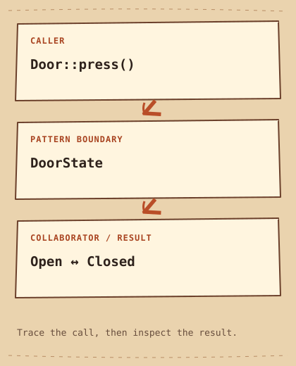

# State

[English](README.md) · [مصري](README.ar-EG.md) · [中文](README.zh-CN.md) · [Italiano](README.it.md)

[Previous](../../behavioral/observer/README.md) · [Category](../README.md) · [Next](../../behavioral/strategy/README.md)

[Learning Path](../../LEARNING_PATH.md) · [Cheat Sheet](../../CHEATSHEET.md) · [Python](python/README.md) · [C++20](cpp/README.md)

## Category

[`Behavioral Pattern`](../../GLOSSARY.md#behavioral-pattern) — A Design Pattern concerned with behavior and collaboration among objects.

## Difficulty

Intermediate

## In One Sentence

Let current State decide how an Object responds.

## Explain It Simply

Pressing a door button opens a closed door but closes an open one. State moves each response and transition into the Object representing that condition.

## The Problem

A door reacts to the same button differently when open and closed; richer devices add locked or jammed states.

## Naive Solution

```cpp
if (open) open = false;
else open = true; // becomes scattered as states and events grow
```

## Why It Becomes a Problem

A boolean toggle is enough for two states, but copying state conditionals across many events makes transitions inconsistent.

## The Idea

Door delegates press to its current DoorState, and that state selects the next state.

## Real-World Analogy

A vending machine treats an input differently before payment and after payment.

## Structure

[Diagram](diagram.md) · [Run the example](cpp/README.md)



```text
Door::press()  -->  DoorState  -->  Open ↔ Closed
```

## Participants

Door is the context. DoorState defines press and name. Open and Closed hold non-owning links to the next state; main keeps both alive longer than Door.

Canonical roles in this example:

- [`Context`](../../GLOSSARY.md#context) — The object that uses a Strategy or delegates behavior to its current State. Here: `Door`.
- [`State interface`](../../GLOSSARY.md#state-interface) — The contract through which a Context delegates state-dependent behavior. Here: `DoorState`.
- [`Concrete State`](../../GLOSSARY.md#concrete-state) — An implementation defining behavior and transitions for one State. Here: `Open, Closed`.

## Python Example

Read the [small Python example](python/README.md) and [source](python/main.py) first. Predict the [output](python/expected.txt), then run and modify it. The notes compare its design with C++20.

## Modern C++20 Example

```cpp
#include <iostream>
#include <string_view>

class Door;
struct DoorState {
    virtual ~DoorState() = default;
    virtual void press(Door& door) const = 0;
    virtual std::string_view name() const = 0;
};
class Door {
    const DoorState* state_;
public:
    explicit Door(const DoorState& state) : state_(&state) {}
    void change(const DoorState& state) { state_ = &state; }
    void press() { state_->press(*this); }
    std::string_view name() const { return state_->name(); }
};
struct Open final : DoorState {
    const DoorState* next = nullptr;
    void press(Door& door) const override { if (next) door.change(*next); }
    std::string_view name() const override { return "open"; }
};
struct Closed final : DoorState {
    const DoorState* next = nullptr;
    void press(Door& door) const override { if (next) door.change(*next); }
    std::string_view name() const override { return "closed"; }
};
int main() {
    Open open;
    Closed closed;
    open.next = &closed;
    closed.next = &open;
    Door door{closed};
    std::cout << door.name() << '\n';
    door.press();
    std::cout << door.name() << '\n';
    door.press();
    std::cout << door.name() << '\n';
}
```

## Example Output

```text
closed
open
closed
```

## When to Use

Use it when state-dependent behavior and transitions spread across several operations.

### Use cases

Protocol sessions and device workflows are suitable contexts when transition rules are explicit.

## When NOT to Use

Avoid it for a trivial toggle or a small explicit enum transition table that stays readable.

## Advantages

Behavior is grouped by state and transitions can be inspected locally.

## Trade-offs

Classes and [`lifetime`](../../GLOSSARY.md#lifetime) relationships add complexity. The demo keeps state objects outside Door, so transitions never destroy the currently executing state; larger designs must preserve that safety.

## Related Patterns

[Strategy](../strategy/README.md) · [Observer](../observer/README.md)

## Common Confusion

Strategy is usually selected by a client to choose an algorithm. State represents [`lifecycle`](../../GLOSSARY.md#lifecycle) and may choose its own transitions.

## Terms to Remember

- `State` — Let an object's current state determine its response and transitions.
- `Context` — The object that uses a Strategy or delegates behavior to its current State. Example: `Door`.
- `State interface` — The contract through which a Context delegates state-dependent behavior. Example: `DoorState`.
- `Concrete State` — An implementation defining behavior and transitions for one State. Example: `Open, Closed`.

## Interview Vocabulary

- [`state transition`](../../GLOSSARY.md#state-transition) — A move from one modeled condition to another after an event.
- [`runtime behavior`](../../GLOSSARY.md#runtime-behavior) — What the program does while executing, including behavior selected from runtime input.
- [`delegation`](../../GLOSSARY.md#delegation) — An object asks a collaborator to perform part of its work.

## Interview Question

Who decides the next state here, and how is that different from choosing a shipping Strategy?

## Mini Challenge

Add Locked so press keeps it locked; provide a separate unlock event and test the transition sequence.

## Check Yourself

1. Who chooses the next State when the door button is pressed?
2. When would the naive solution on this page be easier to maintain? Give a concrete example.
3. Change one input in the Python example. Predict the output and explain which responsibility handles the change.

## Quick Summary

- **Problem:** A door reacts to the same button differently when open and closed; richer devices add locked or jammed states.
- **Solution:** Door delegates press to its current DoorState, and that state selects the next state.
- **Trade-off:** Classes and lifetime relationships add complexity. The demo keeps state objects outside Door, so transitions never destroy the currently executing state; larger designs must preserve that safety.
- **Remember:** Same event, different state, different response.

[Previous](../../behavioral/observer/README.md) · [Category](../README.md) · [Next](../../behavioral/strategy/README.md)
