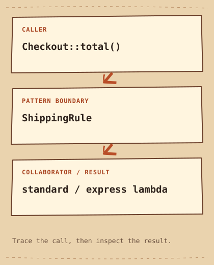

# Strategy

[English](README.md) · [مصري](README.ar-EG.md) · [中文](README.zh-CN.md) · [Italiano](README.it.md)

[السابق](../../behavioral/state/README.ar-EG.md) · [الفئة](../README.ar-EG.md) · [التالي](../../behavioral/template-method/README.ar-EG.md)

[خطة التعلّم](../../LEARNING_PATH.ar-EG.md) · [ملخص سريع](../../CHEATSHEET.ar-EG.md) · [Python](python/README.md) · [C++20](cpp/README.md)

## Category

[`Behavioral Pattern`](../../GLOSSARY.md#behavioral-pattern) — بيركز على سلوك الـ`Objects` وطريقة تعاونها.

## Difficulty

مبتدئ

## In One Sentence

افصل طريقة الحساب (`algorithm`) عن الكائن اللي بيستخدمها، عشان تقدر تختار طريقة بديلة لنفس المهمة.

## ببساطة

الشراء ممكن يحسب شحن عادي أو سريع.الـ`Strategy` بيدي `Checkout` قاعدة شحن يستخدمها، بدل ما حساب الإجمالي يحتوي كل القواعد.

## The Problem

إجمالي الشراء محتاج سياسات شحن مختلفة من غير حشر كل سياسة جوه `Checkout`.

## Naive Solution

```cpp
int fee = express ? (subtotal_cents >= 100 ? 0 : 15) : 5;
```

## Why It Becomes a Problem

شرط واحد مقروء؛ تكرار فروع السياسات في كذا مسار بيصعّب إضافة القواعد واختبارها.

## The Idea

خلّي حساب الشراء `Checkout` يحتفظ بطريقة لحساب رسوم الشحن. بيمثلها عقد قابل للاستدعاء (`callable`) اسمه `ShippingRule`. المستدعي بيختار الطريقة وقت الإنشاء، وحساب الإجمالي بيستخدمها من غير ما يعرف تفاصيلها.

## Real-World Analogy

اختار تخطيط طريق للمشي أو السواقة، والوجهة واحدة.

## Structure

[الرسم التوضيحي](diagram.md) · [شغّل المثال](cpp/README.md)



```text
Checkout::total()  -->  ShippingRule  -->  standard / express lambda
```

## Participants

في المثال، حساب الشراء `Checkout` بيلعب دور `Context`. عقد طريقة الحساب هو `ShippingRule`. بننفّذ طريقتي الشحن العادي والسريع باستخدام دوال قصيرة (`lambdas`).

الأدوار القياسية في المثال ده:

- [`Context`](../../GLOSSARY.md#context) — الكائن اللي بيستخدم `Strategy`، أو بيفوّض تنفيذ السلوك (`behavior`) للحالة الحالية (`State`). هنا: `Checkout`.
- [`Strategy interface`](../../GLOSSARY.md#strategy-interface) — بتحدد العقد المشترك للـ`algorithms` المختلفة. الـ`Context` بيعتمد على العقد ده بدل `implementation` محدد. هنا: `ShippingRule`.
- [`Concrete Strategy`](../../GLOSSARY.md#concrete-strategy) — تنفيذ محدد لعقد `Strategy interface`. ممكن تمثّله بحاجة قابلة للاستدعاء (`callable`)، ومش لازم يكون `class` مستقلة. هنا: `standard / express lambdas`.

## Python Example

ابدأ بـ[مثال Python الصغير](python/README.md) و[الكود](python/main.py). توقّع [الناتج](python/expected.txt)، وبعدها شغّل وعدّل. ملاحظات المثال بالإنجليزي بتوضح الفروق مع C++20.

## Modern C++20 Example

```cpp
// Monetary amounts in this example are integer cents.
#include <functional>
#include <iostream>
#include <stdexcept>
#include <utility>

using ShippingRule = std::function<int(int)>;
class Checkout {
    ShippingRule shipping_;
public:
    explicit Checkout(ShippingRule shipping) : shipping_(std::move(shipping)) {
        if (!shipping_) throw std::invalid_argument("Missing shipping rule");
    }
    int total(int subtotal_cents) const {
        if (subtotal_cents < 0) throw std::invalid_argument("Negative subtotal");
        return subtotal_cents + shipping_(subtotal_cents);
    }
};
int main() {
    const Checkout standard{[](int) { return 5; }};
    const Checkout express{[](int subtotal_cents) { return subtotal_cents >= 100 ? 0 : 15; }};
    std::cout << "Standard: " << standard.total(40) << '\n';
    std::cout << "Express: " << express.total(40) << '\n';
    std::cout << "Express large: " << express.total(120) << '\n';
    std::cout << "Express boundary: " << express.total(100) << '\n';
    try { static_cast<void>(standard.total(-1)); }
    catch (const std::invalid_argument&) { std::cout << "Negative subtotal rejected\n"; }
    try { const Checkout missing{ShippingRule{}}; }
    catch (const std::invalid_argument&) { std::cout << "Missing rule rejected\n"; }
}
```

## Example Output

```text
Standard: 45
Express: 55
Express large: 120
Express boundary: 100
Negative subtotal rejected
Missing rule rejected
```

## When to Use

استخدم `Strategy` لما قواعد الحساب بتتغير بشكل مستقل عن `Checkout`، والمستدعي محتاج يختار القاعدة المناسبة.

### Use cases

مناسب للتسعير والترتيب وسياسات إعادة المحاولة.

## When NOT to Use

بلاش لـ `algorithm` ثابتة واحدة أو شرط واضح مش محتاج توسعة فعلية.

## Advantages

كل سياسة تتختبر لوحدها، وحساب الإجمالي يفضل مشترك.

## Trade-offs

بنستخدم [`std::function`](../../GLOSSARY.md#stdfunction) لتخزين دالة قابلة للاستدعاء بتوقيع محدد، مع إخفاء نوعها الفعلي. ده اسمه [`type erasure`](../../GLOSSARY.md#type-erasure)، وليه تكلفة وممكن يحتاج حجز ذاكرة. حسب القيود، ممكن تختار `template` أو مؤشر دالة (`function pointer`) بدلها. راجع الرسوم لو كود خارجي ممكن يرجع قيم غير صالحة.

## Related Patterns

[State](../state/README.ar-EG.md) · [Template Method](../template-method/README.ar-EG.md)

## Common Confusion

في `Strategy`، بنختار طريقة حل (`algorithm`) لنفس المهمة. أما `State`، فبتمثل مراحل وانتقالات دورة العمل ([`lifecycle`](../../GLOSSARY.md#lifecycle))؛ ودي مش نفس عمر الكائن في الذاكرة (`lifetime`). نمط `Template Method` بيغيّر خطوات موروثة، بدل ما يستقبل طريقة مستقلة قابلة للاستدعاء (`callable`).

## Terms to Remember

- `Strategy` — افصل طريقة الحساب (`algorithm`) عن الكائن اللي بيستخدمها، عشان تقدر تختار طريقة بديلة لنفس المهمة.
- `Context` — الكائن اللي بيستخدم `Strategy`، أو بيفوّض تنفيذ السلوك (`behavior`) للحالة الحالية (`State`). مثال: `Checkout`.
- `Strategy interface` — بتحدد العقد المشترك للـ`algorithms` المختلفة. الـ`Context` بيعتمد على العقد ده بدل `implementation` محدد. مثال: `ShippingRule`.
- `Concrete Strategy` — تنفيذ محدد لعقد `Strategy interface`. ممكن تمثّله بحاجة قابلة للاستدعاء (`callable`)، ومش لازم يكون `class` مستقلة. مثال: `standard / express lambdas`.

## Interview Vocabulary

- [`interchangeable behavior`](../../GLOSSARY.md#interchangeable-behavior) — سلوكيات مختلفة (`behaviors`) تقدر تختار أي واحدة منها من خلال نفس العقد.
- [`encapsulate an algorithm`](../../GLOSSARY.md#encapsulate-an-algorithm) — حط `algorithm` ورا عملية بتخفي خطواتها الداخلية.
- [`composition over inheritance`](../../GLOSSARY.md#composition-over-inheritance) — فضّل تركيب الحل من كائنات متعاونة (`objects`)، لما ده يكون أوضح من توسيع شجرة الوراثة (`inheritance`).
- [`runtime selection`](../../GLOSSARY.md#runtime-selection) — اختيار `implementation` والبرنامج شغال.
- [`loose coupling`](../../GLOSSARY.md#loose-coupling) — كل جزء يعرف العقد الصغير اللي محتاجه للتعاون، فالتعديلات ما تنتشرش بسهولة.

## Interview Question

استخدام معامل نوع (`template parameter`) بدل `std::function` هيأثر إزاي على الاختيار وقت [`runtime`](../../GLOSSARY.md#runtime) والترجمة؟

## Mini Challenge

ضيف شحن مجاني من 80 واختبر 79 و80 و81.

## اختبر فهمك

1. هل الـ`API` العامة في `Checkout` دي بتسمح بتغيير القاعدة بعد الإنشاء؟
2. إمتى الحل البسيط في الصفحة يبقى أسهل في الصيانة؟ ادّي مثال محدد.
3. غيّر مُدخل واحد في مثال Python. توقّع الناتج واشرح أنهي جزء مسؤول عن التغيير.

## Quick Summary

- **المشكلة:** إجمالي الشراء محتاج سياسات شحن مختلفة من غير حشر كل سياسة جوه `Checkout`.
- **الحل:** خلّي حساب الشراء `Checkout` يحتفظ بطريقة لحساب رسوم الشحن. بيمثلها عقد قابل للاستدعاء (`callable`) اسمه `ShippingRule`. المستدعي بيختار الطريقة وقت الإنشاء، وحساب الإجمالي بيستخدمها من غير ما يعرف تفاصيلها.
- **`Trade-off`:** بنستخدم `std::function` لتخزين دالة قابلة للاستدعاء بتوقيع محدد، مع إخفاء نوعها الفعلي. ده اسمه `type erasure`، وليه تكلفة وممكن يحتاج حجز ذاكرة. حسب القيود، ممكن تختار `template` أو مؤشر دالة (`function pointer`) بدلها. راجع الرسوم لو كود خارجي ممكن يرجع قيم غير صالحة.
- **افتكر:** نفس المهمة، اختار الـ `algorithm`.

[السابق](../../behavioral/state/README.ar-EG.md) · [الفئة](../README.ar-EG.md) · [التالي](../../behavioral/template-method/README.ar-EG.md)
