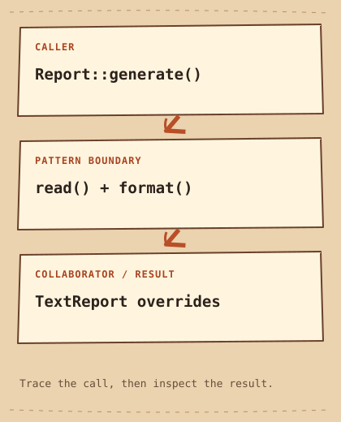

# Template Method

[English](README.md) · [مصري](README.ar-EG.md) · [中文](README.zh-CN.md) · [Italiano](README.it.md)

[Precedente](../../behavioral/strategy/README.it.md) · [Categoria](../README.it.md) · [Successivo](../../behavioral/visitor/README.it.md)

[Percorso di studio](../../LEARNING_PATH.it.md) · [Scheda rapida](../../CHEATSHEET.it.md) · [Python](python/README.md) · [C++20](cpp/README.md)

## Category

[`Behavioral Pattern`](../../GLOSSARY.md#behavioral-pattern) — Un Design Pattern che organizza behavior e collaborazione fra object.

## Difficulty

Intermedio

## In One Sentence

Fissa la sequenza dell'algorithm lasciando alle subclass alcuni passi.

## In parole semplici

I report iniziano, leggono dati, li formattano e terminano.Template Method conserva l’ordine in un metodo; una subclass fornisce i passi variabili.

## The Problem

I report condividono apertura, lettura, formato e chiusura ma variano dati o presentazione.

## Naive Solution

```cpp
void text_report() { /* begin, read, format, end */ }
void html_report() { /* duplicated order, different format */ }
```

## Why It Becomes a Problem

Funzioni complete separate duplicano l'ordine e divergono quando cambia un passo comune.

## The Idea

`Report::generate` mantiene l’ordine delle chiamate e non è `virtual`. I metodi `read` e `format` sono `protected` e `virtual`: le subclass possono cambiarne l’implementazione.

## Real-World Analogy

La ricetta fissa l'ordine ma consente ripieni diversi.

## Structure

[Diagramma](diagram.md) · [Esegui l’esempio](cpp/README.md)



```text
Report::generate()  -->  read() + format()  -->  TextReport overrides
```

## Participants

Report possiede lo scheletro, TextReport implementa le variazioni, il client chiama generate.

Ruoli canonici in questo esempio:

- [`Abstract Class`](../../GLOSSARY.md#abstract-class-template-method-role) — Il ruolo di Template Method che contiene l'algorithm skeleton e dichiara i passi variabili. Qui: `Report`.
- [`Concrete Class`](../../GLOSSARY.md#concrete-class-template-method-role) — Il ruolo di Template Method che fornisce i passi variabili. Qui: `TextReport`.
- [`hook method`](../../GLOSSARY.md#hook-method) — Un'operazione di estensione richiamata da un flusso fisso, eventualmente con implementation predefinita. Qui: `read, format`.

## Python Example

Leggi prima il [piccolo esempio Python](python/README.md) e il [codice](python/main.py). Prevedi l’[output](python/expected.txt), poi esegui e modifica. Le note in inglese confrontano il progetto con C++20.

## Modern C++20 Example

```cpp
#include <iostream>
#include <string>
#include <string_view>

class Report {
protected:
    virtual std::string read() const = 0;
    virtual void format(std::string_view data) const = 0;
public:
    virtual ~Report() = default;
    void generate() const {
        std::cout << "Begin report\n";
        const auto data = read();
        format(data);
        std::cout << "End report\n";
    }
};
class TextReport final : public Report {
    std::string read() const override { return "sales=42"; }
    void format(std::string_view data) const override { std::cout << data << '\n'; }
};
int main() { TextReport{}.generate(); }
```

## Example Output

```text
Begin report
sales=42
End report
```

## When to Use

Usalo per una sequenza stabile con pochi punti di estensione ben definiti.

### Use cases

Pipeline di importazione e report con scheletro stabile.

## When NOT to Use

Evitalo se i passi vanno riordinati a [`runtime`](../../GLOSSARY.md#runtime) o la [`composition`](../../GLOSSARY.md#composition) chiarisce meglio le dependency.

## Advantages

Le regole d'ordine restano nella base; le subclass scrivono solo differenze.

## Trade-offs

L'[`inheritance`](../../GLOSSARY.md#inheritance) lega al protocollo base. End non avviene se un hook lancia: per liberare risorse usa [`RAII`](../../GLOSSARY.md#raii), non l'ultimo passo come garanzia.

## Related Patterns

[Strategy](../strategy/README.it.md) · [Factory Method](../../creational/factory-method/README.it.md)

## Common Confusion

Strategy inietta behavior sostituibile; Template Method usa hook ereditati. Factory Method può essere uno di questi hook.

## Terms to Remember

- `Template Method` — Fissa la sequenza dell'algorithm lasciando alle subclass alcuni passi.
- `Abstract Class` — Il ruolo di Template Method che contiene l'algorithm skeleton e dichiara i passi variabili. Esempio: `Report`.
- `Concrete Class` — Il ruolo di Template Method che fornisce i passi variabili. Esempio: `TextReport`.
- `hook method` — Un'operazione di estensione richiamata da un flusso fisso, eventualmente con implementation predefinita. Esempio: `read, format`.

## Interview Vocabulary

- [`algorithm skeleton`](../../GLOSSARY.md#algorithm-skeleton) — La sequenza fissa di un algorithm di cui alcuni passi possono variare.
- [`inheritance`](../../GLOSSARY.md#inheritance) — Definire una derived class da una base class per riusarne o specializzarne contratto e implementation.
- [`Open/Closed Principle`](../../GLOSSARY.md#openclosed-principle) — Mirare a open for extension, closed for modification lungo un confine scelto e utile.

## Interview Question

Perché generate non è virtual mentre read e format lo sono? Quali invarianti esprime?

## Mini Challenge

Aggiungi CsvReport, verifica l'ordine e simula un'eccezione di formattazione discutendo la pulizia.

## Verifica cosa hai capito

1. Quale metodo controlla l’ordine e quali metodi possono variare?
2. Quando sarebbe più facile mantenere la soluzione semplice della pagina? Fai un esempio concreto.
3. Cambia un input dell’esempio Python. Prevedi l’output e spiega quale parte gestisce il cambiamento.

## Quick Summary

- **Problema:** I report condividono apertura, lettura, formato e chiusura ma variano dati o presentazione.
- **Soluzione:** Report::generate non virtual richiama read e format, hook virtual protected, nell'ordine stabilito.
- **Trade-off:** L'inheritance lega al protocollo base. End non avviene se un hook lancia: per liberare risorse usa RAII, non l'ultimo passo come garanzia.
- **Da ricordare:** Conserva la ricetta, varia i passi.

[Precedente](../../behavioral/strategy/README.it.md) · [Categoria](../README.it.md) · [Successivo](../../behavioral/visitor/README.it.md)
