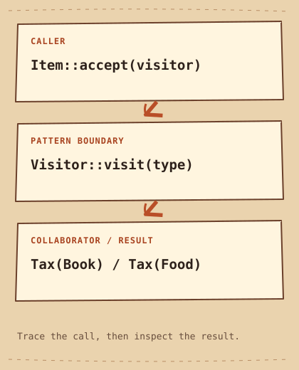

# Visitatore

[English](README.md) · [مصري](README.ar-EG.md) · [中文](README.zh-CN.md) · [Italiano](README.it.md)

[Precedente](../../behavioral/template-method/README.it.md) · [Categoria](../README.it.md)

## Categoria

Comportamentali

## Difficoltà

Avanzato

## In una frase

Aggiungi operazioni a tipi di elemento stabili tramite un visitatore separato.

## Il problema

Un carrello contiene libri e cibo; nuove operazioni come imposte ed export non devono riempire ogni classe.

## Soluzione iniziale

```cpp
// For each new operation, add another virtual method to every Item.
// tax(), export_json(), print_label(), ...
```

## Perché diventa difficile

Aggiungere metodi virtuali per ogni attività obbliga a modificare tutti gli elementi.

## Idea centrale

Ogni Item concreto chiama da accept l'overload Visitor::visit corrispondente; Tax realizza l'operazione.

## Analogia quotidiana

Un ispettore visita stazioni diverse e applica una lista specifica al tipo.

## Diagramma originale

[Diagramma](diagram.md) · [Esegui l’esempio](cpp/README.md)



```text
Item::accept(visitor)  -->  Visitor::visit(type)  -->  Tax(Book) / Tax(Food)
```

## Partecipanti

Item definisce accept; Book e Food selezionano l'overload; Visitor elenca i tipi; Tax accumula il risultato e il carrello possiede gli elementi.

## C++20 moderno — esempio eseguibile completo

```cpp
#include <iostream>
#include <memory>
#include <vector>

struct Book;
struct Food;
struct Visitor {
    virtual ~Visitor() = default;
    virtual void visit(const Book& book) = 0;
    virtual void visit(const Food& food) = 0;
};
struct Item {
    virtual ~Item() = default;
    virtual void accept(Visitor& visitor) const = 0;
};
struct Book final : Item {
    int price = 20;
    void accept(Visitor& visitor) const override { visitor.visit(*this); }
};
struct Food final : Item {
    int price = 10;
    void accept(Visitor& visitor) const override { visitor.visit(*this); }
};
struct Tax final : Visitor {
    int total = 0;
    void visit(const Book& book) override { total += book.price / 10; }
    void visit(const Food& food) override { total += food.price / 5; }
};
int main() {
    std::vector<std::unique_ptr<Item>> basket;
    basket.push_back(std::make_unique<Book>());
    basket.push_back(std::make_unique<Food>());
    Tax tax;
    for (const auto& item : basket) item->accept(tax);
    std::cout << "Tax: " << tax.total << '\n';
}
```

## Output previsto

```text
Tax: 4
```

## Quando usarlo

Usalo con tipi stabili e operazioni nuove frequenti.

## Quando NON usarlo

Evitalo se aumentano spesso i tipi o esporre dettagli rompe l'incapsulamento.

## Vantaggi

Una nuova operazione richiede un visitatore, senza cambiare gli elementi esistenti.

## Svantaggi e compromessi

Un nuovo tipo richiede modifiche al contratto Visitor e a tutti i visitatori. Le aliquote intere sono illustrative, non fiscali reali; l'arrotondamento richiede una politica.

## Applicazioni tecniche

Analisi di AST ed export di documenti con tipi stabili; std::variant e std::visit sono un'alternativa per insiemi chiusi.

## Pattern correlati

[composite](../../structural/composite/README.it.md) · [iterator](../iterator/README.it.md)

## Confusione comune

Iterator attraversa, Visitor seleziona operazioni per tipo, Composite può fornire l'albero.

## Domanda da colloquio

Perché visit(*this) dentro Book sceglie l'overload Book mentre un riferimento Item non basta?

## Piccola sfida

Aggiungi Label senza modificare Book e Food, poi un terzo tipo e conta le modifiche.

## Riepilogo

- **Problema:** Un carrello contiene libri e cibo; nuove operazioni come imposte ed export non devono riempire ogni classe.
- **Soluzione:** Ogni Item concreto chiama da accept l'overload Visitor::visit corrispondente; Tax realizza l'operazione.
- **Compromesso:** Un nuovo tipo richiede modifiche al contratto Visitor e a tutti i visitatori. Le aliquote intere sono illustrative, non fiscali reali; l'arrotondamento richiede una politica.
- **Da ricordare:** Tipi stabili, operazioni nuove.

[Precedente](../../behavioral/template-method/README.it.md) · [Categoria](../README.it.md)
