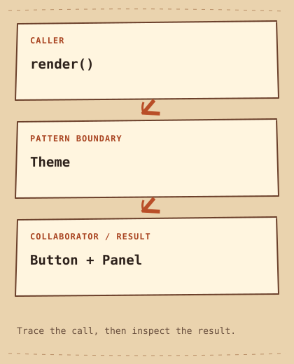

# Abstract Factory

[English](README.md) · [مصري](README.ar-EG.md) · [中文](README.zh-CN.md) · [Italiano](README.it.md)

[الفئة](../README.ar-EG.md) · [التالي](../../creational/builder/README.ar-EG.md)

## Category

[`Creational Pattern`](../../GLOSSARY.md#creational-pattern) — Design Pattern بيركز على إزاي نعمل objects ونجهّزها.

## Difficulty

متوسط

## In One Sentence

اعمل مجموعة objects متوافقة من خلال Factory واحدة.

## The Problem

شاشة الإعدادات محتاجة Buttons و Panels من نفس الـ Theme.

## Naive Solution

```cpp
auto button = DarkButton{};
auto panel = LightPanel{}; // mixed theme
```

## Why It Becomes a Problem

لما كل مكان يعمل الـ Widget بنفسه، ممكن Button غامق يطلع جنب Panel فاتح. كل Client بيضطر يفتكر قواعد التوافق.

## The Idea

مرّر Theme واحدة لـ render. هي اللي بتعمل النوعين، فالـ Client مش محتاج يسمي الـ concrete classes.

## Real-World Analogy

زي ما تطلب طقم أثاث كامل بدل ما تختار كل قطعة لوحدها.

## Structure

[الرسم التوضيحي](diagram.md) · [شغّل المثال](cpp/README.md)



```text
render()  -->  Theme  -->  Button + Panel
```

## Participants

Theme بتحدد المجموعة؛ DarkTheme و LightTheme بيعملوها. Button و Panel interfaces المنتجات، و render بيستخدمهم.

الأدوار القياسية في المثال ده:

- [`Product`](../../GLOSSARY.md#product) — العقد بتاع الـ object اللي كود الإنشاء بيرجعها. هنا: `Button, Panel`.
- [`Concrete Product`](../../GLOSSARY.md#concrete-product) — implementation فعلية لعقد Product. هنا: `DarkButton, LightButton, DarkPanel, LightPanel`.
- [`Concrete Factory`](../../GLOSSARY.md#concrete-factory) — implementation بتعمل عيلة Product متوافقة. هنا: `DarkTheme, LightTheme`.

## Modern C++20 Example

```cpp
#include <iostream>
#include <memory>
#include <string_view>

struct Button {
    virtual ~Button() = default;
    virtual std::string_view paint() const = 0;
};
struct Panel {
    virtual ~Panel() = default;
    virtual std::string_view paint() const = 0;
};
struct DarkButton final : Button {
    std::string_view paint() const override { return "dark button"; }
};
struct DarkPanel final : Panel {
    std::string_view paint() const override { return "dark panel"; }
};
struct LightButton final : Button {
    std::string_view paint() const override { return "light button"; }
};
struct LightPanel final : Panel {
    std::string_view paint() const override { return "light panel"; }
};
struct Theme {
    virtual ~Theme() = default;
    virtual std::unique_ptr<Button> button() const = 0;
    virtual std::unique_ptr<Panel> panel() const = 0;
};
struct DarkTheme final : Theme {
    std::unique_ptr<Button> button() const override { return std::make_unique<DarkButton>(); }
    std::unique_ptr<Panel> panel() const override { return std::make_unique<DarkPanel>(); }
};
struct LightTheme final : Theme {
    std::unique_ptr<Button> button() const override { return std::make_unique<LightButton>(); }
    std::unique_ptr<Panel> panel() const override { return std::make_unique<LightPanel>(); }
};
void render(const Theme& theme) {
    const auto button = theme.button();
    const auto panel = theme.panel();
    std::cout << button->paint() << " + " << panel->paint() << '\n';
}
int main() {
    render(DarkTheme{});
    render(LightTheme{});
}
```

## Example Output

```text
dark button + dark panel
light button + light panel
```

## When to Use

استخدمه لما كذا نوع من المنتجات لازم يتغيروا مع بعض، والـ Client ماينفعش يختار الـ classes بنفسه.

### Use cases

ينفع مع Themes أو مجموعات Database Drivers المتوافقة؛ المثال هنا بيطبع أسماء بس.

## When NOT to Use

بلاش لو عندك نوع واحد ثابت، أو لو الاختيارات المستقلة مطلوبة أصلاً.

## Advantages

تقدر تبدّل المجموعة كلها من غير ما تغيّر خطوات العرض.

## Trade-offs

إضافة منتج زي Slider بتحتاج تعديل كل Factory. الـ [`interface`](../../GLOSSARY.md#interface) (العقد اللي بيحدد العمليات المتاحة وإيه اللي المستدعي يتوقعه منها) لوحدها مش بتضمن إن الألوان متوافقة فعلاً.

## Related Patterns

[Factory Method](../factory-method/README.ar-EG.md) · [Builder](../builder/README.ar-EG.md)

## Common Confusion

Factory Method بتغيّر خطوة إنشاء واحدة. Abstract Factory بتنسّق أنواع منتجات مرتبطة، وممكن تستخدم Factory Methods جواها.

## Terms to Remember

- `Abstract Factory` — اعمل مجموعة objects متوافقة من خلال Factory واحدة.
- `Product` — العقد بتاع الـ object اللي كود الإنشاء بيرجعها. مثال: `Button, Panel`.
- `Concrete Product` — implementation فعلية لعقد Product. مثال: `DarkButton, LightButton, DarkPanel, LightPanel`.
- `Concrete Factory` — implementation بتعمل عيلة Product متوافقة. مثال: `DarkTheme, LightTheme`.

## Interview Vocabulary

- [`object creation`](../../GLOSSARY.md#object-creation) — اختيار النوع الفعلي وتجهيز القيم الأولية وبدء lifetime بتاعة object.
- [`program to an interface, not an implementation`](../../GLOSSARY.md#program-to-an-interface-not-an-implementation) — اعتمد على العقد المعلن بدل تفاصيل implementation بعينها.
- [`encapsulate what varies`](../../GLOSSARY.md#encapsulate-what-varies) — حط القرار اللي بيتغير ورا حدود ثابتة وواضحة.

## Interview Question

إيه اللي بيتغير لما تضيف Theme ، وإيه اللي بيتغير لما تضيف Widget جديدة؟

## Mini Challenge

ضيف مجموعة High Contrast ، وبعدها ضيف Slider وقارن حجم التعديلات.

## Quick Summary

- **المشكلة:** شاشة الإعدادات محتاجة Buttons و Panels من نفس الـ Theme.
- **الحل:** مرّر Theme واحدة لـ render. هي اللي بتعمل النوعين، فالـ Client مش محتاج يسمي الـ concrete classes.
- **Trade-off:** إضافة منتج زي Slider بتحتاج تعديل كل Factory. الـ interface لوحدها مش بتضمن إن الألوان متوافقة فعلاً.
- **افتكر:** Factory واحدة، طقم متوافق.

[الفئة](../README.ar-EG.md) · [التالي](../../creational/builder/README.ar-EG.md)
