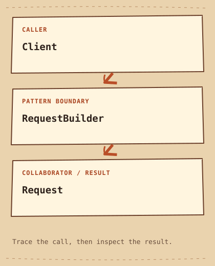

# Builder

[English](README.md) · [مصري](README.ar-EG.md) · [中文](README.zh-CN.md) · [Italiano](README.it.md)

[Previous](../../creational/abstract-factory/README.md) · [Category](../README.md) · [Next](../../creational/factory-method/README.md)

[Learning Path](../../LEARNING_PATH.md) · [Cheat Sheet](../../CHEATSHEET.md) · [Python](python/README.md) · [C++20](cpp/README.md)

## Category

[`Creational Pattern`](../../GLOSSARY.md#creational-pattern) — A Design Pattern concerned with how objects are created and configured.

## Difficulty

Beginner

## In One Sentence

Build an Object through clear steps.

## Explain It Simply

A request has several options, and a long constructor call hides what each value means. Builder collects named choices, checks them, then creates the result.

## The Problem

A request has an endpoint, a timeout and a retry option; positional arguments become hard to read as options grow.

## Naive Solution

```cpp
Request request{"/orders", 5, true}; // what does true mean?
```

## Why It Becomes a Problem

The constructor works, but calls with several integers and booleans hide intent and make swapped arguments hard to notice.

## The Idea

Keep construction state in RequestBuilder. Named methods collect choices; build checks required values and returns a Request by value.

## Real-World Analogy

A sandwich order names each choice before the kitchen prepares the final meal.

## Structure

[Diagram](diagram.md) · [Run the example](cpp/README.md)



```text
Client  -->  RequestBuilder  -->  Request
```

## Participants

RequestBuilder stores temporary choices and validates them. Request owns the finished values. The client chooses the order of optional steps.

Canonical roles in this example:

- [`Product`](../../GLOSSARY.md#product) — The contract of an object returned by creation code. Here: `Request`.
- [`fluent interface`](../../GLOSSARY.md#fluent-interface) — An interface shaped to read as a chain of calls; it does not by itself imply Builder. Here: `RequestBuilder.endpoint().timeout().retry()`.
- [`constructor`](../../GLOSSARY.md#constructor) — The special operation that initializes a new class instance. Here: `Request::Request`.

## Python Example

Read the [small Python example](python/README.md) and [source](python/main.py) first. Predict the [output](python/expected.txt), then run and modify it. The notes compare its design with C++20.

## Modern C++20 Example

```cpp
#include <iostream>
#include <stdexcept>
#include <string>
#include <utility>

class Request {
    std::string endpoint_;
    int timeout_;
    bool retry_;
public:
    Request(std::string endpoint, int timeout, bool retry)
        : endpoint_(std::move(endpoint)), timeout_(timeout), retry_(retry) {}
    void describe() const {
        std::cout << endpoint_ << " timeout=" << timeout_ << " retry=" << retry_ << '\n';
    }
};
class RequestBuilder {
    std::string endpoint_;
    int timeout_ = 30;
    bool retry_ = false;
public:
    RequestBuilder& endpoint(std::string value) { endpoint_ = std::move(value); return *this; }
    RequestBuilder& timeout(int seconds) { timeout_ = seconds; return *this; }
    RequestBuilder& retry(bool enabled) { retry_ = enabled; return *this; }
    Request build() const {
        if (endpoint_.empty() || timeout_ <= 0) throw std::invalid_argument("Invalid request");
        return Request{endpoint_, timeout_, retry_};
    }
};
int main() {
    const auto request = RequestBuilder{}.endpoint("/orders").timeout(5).retry(true).build();
    request.describe();
    try { static_cast<void>(RequestBuilder{}.build()); }
    catch (const std::invalid_argument&) { std::cout << "Invalid request rejected\n"; }
}
```

## Example Output

```text
/orders timeout=5 retry=1
Invalid request rejected
```

## When to Use

Use it for objects with many independent options or a meaningful validation boundary.

### Use cases

HTTP request configuration and test fixture assembly fit; this example performs no network request.

## When NOT to Use

Avoid it for two obvious constructor arguments; a small aggregate with named fields may be clearer.

## Advantages

Call sites explain the choices, and invalid builder state can be rejected before producing a result.

## Trade-offs

There is an extra type to maintain. This Request constructor remains public, so production invariants would also need constructor validation or restricted access.

## Related Patterns

[Factory Method](../factory-method/README.md) · [Abstract Factory](../abstract-factory/README.md)

## Common Confusion

Factory Method chooses the concrete product inside an inherited workflow. Builder assembles the configuration of a result over several calls.

## Terms to Remember

- `Builder` — Assemble a configured object through named steps before producing the result.
- `Product` — The contract of an object returned by creation code. Example: `Request`.
- `fluent interface` — An interface shaped to read as a chain of calls; it does not by itself imply Builder. Example: `RequestBuilder.endpoint().timeout().retry()`.
- `constructor` — The special operation that initializes a new class instance. Example: `Request::Request`.

## Interview Vocabulary

- [`object creation`](../../GLOSSARY.md#object-creation) — Choosing a concrete type and establishing an object's initial values and lifetime.
- [`separation of concerns`](../../GLOSSARY.md#separation-of-concerns) — Keeping distinct kinds of responsibility apart so they can change independently.
- [`single responsibility`](../../GLOSSARY.md#single-responsibility) — Keep a module focused on one coherent reason to change.

## Interview Question

Does a fluent interface automatically make something a Builder? Explain where construction ends.

## Mini Challenge

Reject timeouts above 120 and demonstrate both the boundary value and the first rejected value.

## Check Yourself

1. What happens if a caller bypasses build and calls Request directly?
2. When would the naive solution on this page be easier to maintain? Give a concrete example.
3. Change one input in the Python example. Predict the output and explain which responsibility handles the change.

## Quick Summary

- **Problem:** A request has an endpoint, a timeout and a retry option; positional arguments become hard to read as options grow.
- **Solution:** Keep construction state in RequestBuilder. Named methods collect choices; build checks required values and returns a Request by value.
- **Trade-off:** There is an extra type to maintain. This Request constructor remains public, so production invariants would also need constructor validation or restricted access.
- **Remember:** Choose steps, then build.

[Previous](../../creational/abstract-factory/README.md) · [Category](../README.md) · [Next](../../creational/factory-method/README.md)
