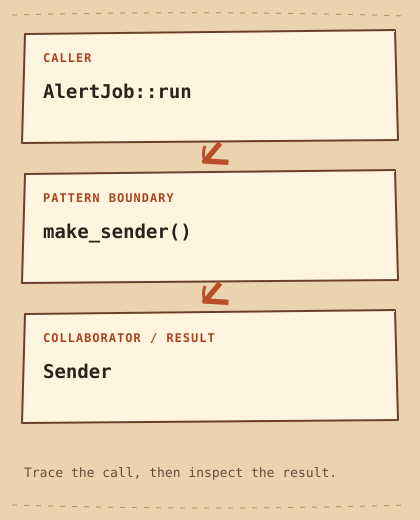

# Factory Method

[English](README.md) · [مصري](README.ar-EG.md) · [中文](README.zh-CN.md) · [Italiano](README.it.md)

[Previous](../../creational/builder/README.md) · [Category](../README.md) · [Next](../../creational/prototype/README.md)

## Category

Creational

## Difficulty

Beginner

## In One Sentence

Let a subclass choose the object used by a shared workflow.

## The Problem

An alert job always sends a completion message, but different environments need different senders.

## A Naive Solution

```cpp
void run() {
    EmailSender sender;
    sender.send("build complete");
}
```

## Why This Becomes a Problem

Hardcoding EmailSender inside run couples the workflow to email; copying run for console delivery duplicates the workflow.

## The Idea

Put the workflow in AlertJob and call the overridable make_sender creation step.

## Real-World Analogy

A delivery office follows the same dispatch process while each branch chooses its vehicle.

## Structure

[Diagram](diagram.md) · [Run the example](cpp/README.md)



```text
AlertJob::run  -->  make_sender()  -->  Sender
```

## Participants

AlertJob owns the workflow. EmailJob and ConsoleJob override creation. Sender supplies the operation and the returned unique_ptr owns the product.

## Modern C++20 Example

```cpp
#include <iostream>
#include <memory>
#include <string_view>

struct Sender {
    virtual ~Sender() = default;
    virtual void send(std::string_view message) const = 0;
};
struct EmailSender final : Sender {
    void send(std::string_view message) const override { std::cout << "Email: " << message << '\n'; }
};
struct ConsoleSender final : Sender {
    void send(std::string_view message) const override { std::cout << "Console: " << message << '\n'; }
};
class AlertJob {
protected:
    virtual std::unique_ptr<Sender> make_sender() const = 0;
public:
    virtual ~AlertJob() = default;
    void run() const {
        const auto sender = make_sender();
        sender->send("build complete");
    }
};
class EmailJob final : public AlertJob {
    std::unique_ptr<Sender> make_sender() const override { return std::make_unique<EmailSender>(); }
};
class ConsoleJob final : public AlertJob {
    std::unique_ptr<Sender> make_sender() const override { return std::make_unique<ConsoleSender>(); }
};
int main() {
    EmailJob{}.run();
    ConsoleJob{}.run();
}
```

## Example Output

```text
Email: build complete
Console: build complete
```

## When to Use It

Use it when an existing inheritance-based workflow needs an extensible creation step.

## When NOT to Use It

Avoid it when passing a ready-made Sender into a function is sufficient; inheritance would add needless structure.

## Advantages

The workflow stays in one place while product selection varies.

## Disadvantages / Trade-offs

Each new selection may need a subclass. Calling virtual creation from a base constructor would not dispatch to a derived override as intended.

## Technical Use Cases

Pluggable exporters and environment-specific job runners are plausible applications; the senders here only print text.

## Related Patterns

[abstract-factory](../abstract-factory/README.md) · [template-method](../../behavioral/template-method/README.md)

## Common Confusion

A free function containing a switch is a simple factory, not this GoF subclass extension point. Abstract Factory instead coordinates a family.

## Interview Question

Why does run call make_sender after construction rather than from AlertJob's constructor?

## Mini Challenge

Add a FileJob with a sender that writes to a temporary file, and verify its contents.

## Quick Summary

- **Problem:** An alert job always sends a completion message, but different environments need different senders.
- **Solution:** Put the workflow in AlertJob and call the overridable make_sender creation step.
- **Trade-off:** Each new selection may need a subclass. Calling virtual creation from a base constructor would not dispatch to a derived override as intended.
- **Remember:** Keep the workflow; override creation.

[Previous](../../creational/builder/README.md) · [Category](../README.md) · [Next](../../creational/prototype/README.md)
