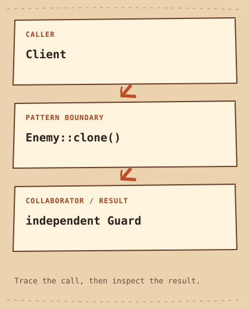

# Prototype

[English](README.md) · [مصري](README.ar-EG.md) · [中文](README.zh-CN.md) · [Italiano](README.it.md)

[Previous](../../creational/factory-method/README.md) · [Category](../README.md) · [Next](../../creational/singleton/README.md)

## Category

[`Creational Pattern`](../../GLOSSARY.md#creational-pattern) — A Design Pattern concerned with how objects are created and configured.

## Difficulty

Intermediate

## In One Sentence

Create an independent object by cloning an existing configured object.

## The Problem

A game needs several enemies based on a configured template whose concrete type the spawning code does not know.

## Naive Solution

```cpp
Guard another;
another.rename("gate guard"); // must repeat any custom setup
```

## Why It Becomes a Problem

Reconstructing a default Guard repeats setup and loses any custom equipment on the template.

## The Idea

Expose clone on Enemy. Guard copies its value members and returns a [`std::unique_ptr`](../../GLOSSARY.md#stdunique_ptr) (A smart pointer with exclusive ownership that releases its object when the owner is destroyed) to an independent object.

## Real-World Analogy

Make a copy of a prepared document, then rename the copy without changing the original.

## Structure

[Diagram](diagram.md) · [Run the example](cpp/README.md)



```text
Client  -->  Enemy::clone()  -->  independent Guard
```

## Participants

Enemy defines polymorphic cloning; Guard implements the copy; the client owns the clone and changes its name.

Canonical roles in this example:

- [`Concrete Prototype`](../../GLOSSARY.md#concrete-prototype) — An object whose clone operation produces another object from its configured values. Here: `Guard`.
- [`deep copy`](../../GLOSSARY.md#deep-copy) — Copying owned nested data so the new object does not share that mutable data with the original. Here: `Guard::clone`.
- [`value semantics`](../../GLOSSARY.md#value-semantics) — Copies behave as independent values according to the type's contract. Here: `name_, equipment_`.

## Modern C++20 Example

```cpp
#include <iostream>
#include <memory>
#include <string>
#include <utility>
#include <vector>

struct Enemy {
    virtual ~Enemy() = default;
    virtual std::unique_ptr<Enemy> clone() const = 0;
    virtual void rename(std::string name) = 0;
    virtual void describe() const = 0;
};
class Guard final : public Enemy {
    std::string name_ = "template";
    std::vector<std::string> equipment_{"shield", "spear"};
public:
    std::unique_ptr<Enemy> clone() const override { return std::make_unique<Guard>(*this); }
    void rename(std::string name) override { name_ = std::move(name); }
    void describe() const override {
        std::cout << name_ << ": " << equipment_.size() << " items\n";
    }
};
int main() {
    const Guard prototype;
    auto copy = prototype.clone();
    copy->rename("gate guard");
    prototype.describe();
    copy->describe();
}
```

## Example Output

```text
template: 2 items
gate guard: 2 items
```

## When to Use

Use it when [`runtime`](../../GLOSSARY.md#runtime) (The period when a compiled program is executing) objects carry useful configuration and clients should not reconstruct their concrete types.

### Use cases

Game entity templates and editable document presets fit; this example copies a string and std::vector with value semantics.

## When NOT to Use

Avoid it when ordinary value copying already expresses the requirement clearly.

## Advantages

Configured state can be reused without exposing each construction step to the client.

## Trade-offs

Pointers require a deliberate deep-versus-shared-copy policy. Copying live sockets or unique external resources may be impossible or misleading.

## Related Patterns

[Abstract Factory](../abstract-factory/README.md) · [Memento](../../behavioral/memento/README.md)

## Common Confusion

Memento restores a previous state of an object. Prototype creates another object; a copy constructor alone does not provide polymorphic cloning.

## Terms to Remember

- `Prototype` — Create an independent object by cloning an existing configured object.
- `Concrete Prototype` — An object whose clone operation produces another object from its configured values. Example: `Guard`.
- `deep copy` — Copying owned nested data so the new object does not share that mutable data with the original. Example: `Guard::clone`.
- `value semantics` — Copies behave as independent values according to the type's contract. Example: `name_, equipment_`.

## Interview Vocabulary

- [`object creation`](../../GLOSSARY.md#object-creation) — Choosing a concrete type and establishing an object's initial values and lifetime.
- [`polymorphism`](../../GLOSSARY.md#polymorphism) — Using one interface with different implementations; C++ supports runtime and compile-time forms.
- [`ownership`](../../GLOSSARY.md#ownership) — Responsibility for keeping a resource alive and eventually releasing it.

## Interview Question

If equipment becomes `std::vector<std::shared_ptr<Item>>`, will clone still be independent? Explain the aliasing.

## Mini Challenge

Add editable equipment and verify that changing the clone's equipment leaves the prototype unchanged.

## Quick Summary

- **Problem:** A game needs several enemies based on a configured template whose concrete type the spawning code does not know.
- **Solution:** Expose clone on Enemy. Guard copies its value members and returns a std::unique_ptr to an independent object.
- **Trade-off:** Pointers require a deliberate deep-versus-shared-copy policy. Copying live sockets or unique external resources may be impossible or misleading.
- **Remember:** Copy the setup, not the identity.

[Previous](../../creational/factory-method/README.md) · [Category](../README.md) · [Next](../../creational/singleton/README.md)
