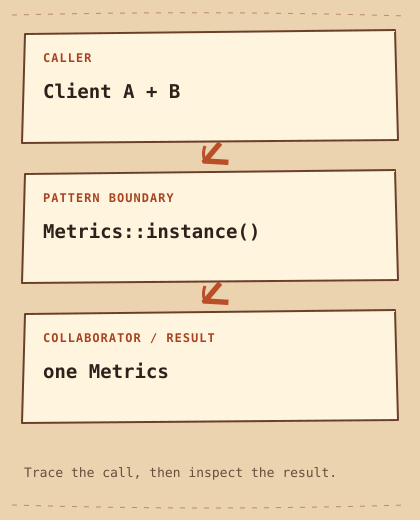

# Singleton

[English](README.md) · [مصري](README.ar-EG.md) · [خطة التعلّم](../../LEARNING_PATH.ar-EG.md) · [Python](python/main.py) · [C++20](cpp/main.cpp)

**الفكرة في سطر:** اسمح بوجود نسخة واحدة متاحة من النوع (`instance`)، وخد بالك من تكلفة الحالة العامة المشتركة (`shared global state`).

## المشكلة

عدادين `Metrics` منفصلين بيقسّموا إجمالي المفروض يكون واحد للعملية كلها. لو الـ `constructor` عامة، كل `Caller` ممكن يعمل عداده، والإجمالي المشترك مش هيبقى مشترك.

## الحل ببساطة

كذا مستدعي محتاجين نفس عدّاد الطلبات.الـ`Singleton` بيتحكم في الإنشاء، بس مشاركة الـ`state` بتصعّب عزل الاختبارات والـ`Dependencies`. اخفي الإنشاء وامنع النسخ. خلّي الدالة `instance` ترجع نفس المتغير المحلي، المعرّف بالكلمة `static`، في كل استدعاء.

الـ **interface** هو الاتفاق اللي الكود المستدعي متوقعه: هيستدعي إيه، وإيه النتيجة. المثال بيحط المسؤولية دي في مكان واضح بدل ما تتكرر في كل مكان.

## اقرأ الرسمة



```text
Client A + B  -->  Metrics::instance()  -->  one Metrics
```

في المثال، `Metrics` بتتحكم في عمر النسخة وبتخزّن العداد. الدالة `instance` بترجع مرجع مش مالك (`non-owning reference`)؛ ممنوع تحاول تحرر النسخة باستخدام `delete`.

الأدوار القياسية في المثال ده:

- [`instance`](../../GLOSSARY.md#instance) — كائن محدد (`object`) من نوع معين. هنا: `Metrics::instance()`.
- [`global state`](../../GLOSSARY.md#global-state) — بيانات أجزاء كتير تقدر توصلها، وتغييرها ممكن يأثر على كود بعيد. هنا: `Metrics::requests_`.
- [`thread-safe initialization`](../../GLOSSARY.md#thread-safe-initialization) — حماية التهيئة من الإنشاء المتزامن؛ مش معناها إن كل العمليات بعد كده `thread-safe`. هنا: `static Metrics metrics`.

الأسهم بتوضح مسار المثال ده، مش كل تطبيق ممكن للـ pattern. [شرح الرسمة](diagram.md).

## امشِ مع الكود

ابدأ من `main` في C++ أو من آخر جزء في Python. تابع الدور اللي في نص الرسمة، وبعدين شوف الناتج. الكود الكامل موجود كمان في [ملف Python](python/main.py) و[ملف C++20](cpp/main.cpp).

## Python example

```python
class Metrics:
    def __init__(self):
        self.requests = 0

    def record(self):
        self.requests += 1


# One shared instance under normal imports of this module.
# This expresses shared access, not a ban on creating other Metrics objects.
metrics = Metrics()


def main():
    first = metrics
    second = metrics
    first.record()
    second.record()
    print("Same instance:", first is second)
    print("Requests:", metrics.requests)


if __name__ == "__main__":
    main()
```

### Python output

```text
Same instance: True
Requests: 2
```

## C++20 example

```cpp
#include <iostream>

class Metrics {
    int requests_ = 0;
    Metrics() = default;
public:
    Metrics(const Metrics&) = delete;
    Metrics& operator=(const Metrics&) = delete;
    static Metrics& instance() {
        static Metrics metrics;
        return metrics;
    }
    void record() { ++requests_; }
    int requests() const { return requests_; }
};
int main() {
    auto& first = Metrics::instance();
    auto& second = Metrics::instance();
    first.record();
    second.record();
    std::cout << "Same instance: " << std::boolalpha << (&first == &second) << '\n';
    std::cout << "Requests: " << first.requests() << '\n';
}
```

### C++20 output

```text
Same instance: true
Requests: 2
```

## قارن اللغتين

Python uses one module-level instance, a common alternative to a strict Singleton Class. It does not prevent callers from constructing Metrics. C++ makes its constructor private and deletes copying. Shared mutable State complicates isolation in both; prefer passing a Dependency explicitly. Neither counter is thread-safe.

الفكرة واحدة في المثالين، حتى لو تفاصيل اللغة والناتج اختلفت. اقرأ الناتجين قبل ما تغيّر أي قيمة.

## إمتى تستخدمه؟

فكّر فيه بس لو الـ `instance` الواحدة شرط حقيقي على مستوى العملية وعمرها مناسب.

### Use cases

عداد تشخيص بسيط في `Thread` واحدة بيوضح الفكرة، مش توصية بمعمارية `Metrics` للإنتاج.

**التكلفة:** الوصول العام بيخفي الـ `dependencies` وبيخلط الاختبارات. تهيئة الـ `static` آمنة بين الـ `Threads`، لكن `record` مش آمنة؛ التزامن محتاج حماية، وترتيب الإغلاق ممكن يفرق.

## جرّب تجاوب

1. إزاي اختبار يسيب `State` في العدّاد تأثر على الاختبار اللي بعده؟
2. إمتى الحل البسيط في الصفحة يبقى أسهل في الصيانة؟ ادّي مثال محدد.
3. غيّر مُدخل واحد في مثال Python. توقّع الناتج واشرح أنهي جزء مسؤول عن التغيير.

**تجربة صغيرة:** غيّر المثال عشان تمرّر عداد لمهمتين، وبعدها اختبر عدادين معزولين.

[كل الأنماط](../../README.ar-EG.md) · [المصطلحات](../../GLOSSARY.md) · [دليل Python](../../PYTHON_EXAMPLES.md) · [دليل C++20](../../CPP_EXAMPLES.md)
