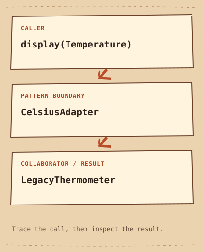

# Adapter

[English](README.md) · [مصري](README.ar-EG.md) · [中文](README.zh-CN.md) · [Italiano](README.it.md)

[上一个](../../creational/singleton/README.zh-CN.md) · [类别](../README.zh-CN.md) · [下一个](../../structural/bridge/README.zh-CN.md)

[学习路线](../../LEARNING_PATH.zh-CN.md) · [速查表](../../CHEATSHEET.zh-CN.md) · [Python](python/README.md) · [C++20](cpp/README.md)

## Category

[`Structural Pattern`](../../GLOSSARY.md#structural-pattern) — 关注 object 与 class 如何组织在一起的 Design Pattern。

## Difficulty

入门

## In One Sentence

把已有 [`interface`](../../GLOSSARY.md#interface) 转换成 Client 期待的 interface。

## 简单理解

传感器返回华氏温度，显示端需要摄氏温度。Adapter 转换调用和值，两端原有代码都不用修改。

## The Problem

仪表盘使用摄氏度，旧传感器却返回华氏度。

## Naive Solution

```cpp
double displayed = sensor.fahrenheit(); // UI expects Celsius
```

## Why It Becomes a Problem

直接传值会显示错误单位；到处写换算公式又会重复兼容逻辑。

## The Idea

用 CelsiusAdapter 实现 Temperature，在边界处调用借用的旧传感器并换算。

## Real-World Analogy

旅行插头连接不同插座；这里还需要转换数值含义。

## Structure

[结构图](diagram.md) · [运行示例](cpp/README.md)



```text
display(Temperature)  -->  CelsiusAdapter  -->  LegacyThermometer
```

## Participants

Temperature 是 Target interface，LegacyThermometer 是旧 API， Adapter 借用传感器，display 只依赖 Target interface。

本例中的标准角色：

- [`Target`](../../GLOSSARY.md#target) — Client 期望使用的 interface。 对应代码： `Temperature`。
- [`Adaptee`](../../GLOSSARY.md#adaptee) — 其现有 interface 需要适配的 object。 对应代码： `LegacyThermometer`。
- [`interface`](../../GLOSSARY.md#interface) — 约定可调用的操作及其对外可观察行为。 对应代码： `Temperature`。

## Python Example

先读[简短的 Python 示例](python/README.md)和[源码](python/main.py)。预测[输出](python/expected.txt)，然后运行并修改。示例中的英文说明比较了它与 C++20 的设计。

## Modern C++20 Example

```cpp
#include <iostream>
#include <stdexcept>

class LegacyThermometer {
public:
    double fahrenheit() const { return 77.0; }
};
struct Temperature {
    virtual ~Temperature() = default;
    virtual double celsius() const = 0;
};
class CelsiusAdapter final : public Temperature {
    const LegacyThermometer& sensor_;
public:
    explicit CelsiusAdapter(const LegacyThermometer& sensor) : sensor_(sensor) {}
    double celsius() const override { return (sensor_.fahrenheit() - 32.0) * 5.0 / 9.0; }
};
void display(const Temperature& temperature) {
    std::cout << temperature.celsius() << " C\n";
}
int main() {
    const LegacyThermometer sensor;
    const CelsiusAdapter adapter{sensor};
    display(adapter);
}
```

## Example Output

```text
25 C
```

## When to Use

适合不能或不宜修改的已有 API 边界。

### Use cases

适合旧 API 集成和单位转换，但精度与错误处理仍需明确约定。

## When NOT to Use

双方 interface 都由你控制，统一 interface 更简单时，不必适配。

## Advantages

换算集中在一处，显示逻辑也能使用其他 Temperature 实现。

## Trade-offs

仅改 method 名可能掩盖语义差异； reference 不拥有传感器，因此传感器必须活得更久。

## Related Patterns

[Facade](../facade/README.zh-CN.md) · [Bridge](../bridge/README.zh-CN.md)

## Common Confusion

Facade 简化 subsystem； Adapter 使已有 interface 满足目标契约。

## Terms to Remember

- `Adapter` — 把已有 interface 转换成 Client 期待的 interface。
- `Target` — Client 期望使用的 interface。 示例： `Temperature`。
- `Adaptee` — 其现有 interface 需要适配的 object。 示例： `LegacyThermometer`。
- `interface` — 约定可调用的操作及其对外可观察行为。 示例： `Temperature`。

## Interview Vocabulary

- [`program to an interface, not an implementation`](../../GLOSSARY.md#program-to-an-interface-not-an-implementation) — 依赖公开约定，而不是某个具体 implementation。
- [`delegation`](../../GLOSSARY.md#delegation) — 一个 object 把部分工作交给协作方完成。
- [`lifetime`](../../GLOSSARY.md#lifetime) — object 存在且可按规则使用的时间区间。

## Interview Question

如果源 interface 异步而 Target interface 同步， Adapter 总能保持原有 behavior 吗？

## Mini Challenge

让旧传感器返回可配置的华氏温度，测试冰点和沸点。

## 检查理解

1. 谁转换单位？谁保证传感器的 Lifetime？
2. 本页的简单方案在什么情况下更容易维护？请举一个具体例子。
3. 修改 Python 示例中的一个输入，预测输出，并说明由哪个部分负责处理。

## Quick Summary

- **问题:** 仪表盘使用摄氏度，旧传感器却返回华氏度。
- **方案:** 用 CelsiusAdapter 实现 Temperature，在边界处调用借用的旧传感器并换算。
- **权衡:** 仅改 method 名可能掩盖语义差异； reference 不拥有传感器，因此传感器必须活得更久。
- **记忆提示:** 在边界完成转换。

[上一个](../../creational/singleton/README.zh-CN.md) · [类别](../README.zh-CN.md) · [下一个](../../structural/bridge/README.zh-CN.md)
