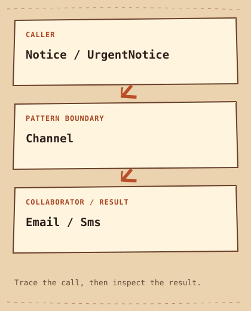

# Bridge

[English](README.md) · [مصري](README.ar-EG.md) · [中文](README.zh-CN.md) · [Italiano](README.it.md)

[Precedente](../../structural/adapter/README.it.md) · [Categoria](../README.it.md) · [Successivo](../../structural/composite/README.it.md)

[Percorso di studio](../../LEARNING_PATH.it.md) · [Scheda rapida](../../CHEATSHEET.it.md) · [Python](python/README.md) · [C++20](cpp/README.md)

## Category

[`Structural Pattern`](../../GLOSSARY.md#structural-pattern) — Un Design Pattern che organizza le relazioni fra object e class.

## Difficulty

Intermedio

## In One Sentence

Separa due dimensioni variabili e collegale tramite [`composition`](../../GLOSSARY.md#composition).

## In parole semplici

Un avviso può essere normale o urgente, il canale email o SMS.Bridge collega avviso e canale senza richiedere una Class per ogni combinazione.

## The Problem

Gli avvisi variano per urgenza e canale, con estensioni indipendenti.

## Naive Solution

```cpp
struct UrgentEmailNotice {};
struct UrgentSmsNotice {};
struct NormalEmailNotice {};
struct NormalSmsNotice {};
```

## Why It Becomes a Problem

Una class per ogni coppia moltiplica le combinazioni e duplica la consegna.

## The Idea

Notice delega a Channel; UrgentNotice cambia il messaggio senza scegliere il trasporto.

## Real-World Analogy

Un telecomando e il collegamento radio possono evolvere separatamente attraverso un piccolo protocollo.

## Structure

[Diagramma](diagram.md) · [Esegui l’esempio](cpp/README.md)



```text
Notice / UrgentNotice  -->  Channel  -->  Email / Sms
```

## Participants

Notice è l'[`abstraction`](../../GLOSSARY.md#abstraction), UrgentNotice la raffina, Channel è il contratto d'[`implementation`](../../GLOSSARY.md#implementation), Email e Sms consegnano.

Ruoli canonici in questo esempio:

- [`Abstraction`](../../GLOSSARY.md#abstraction-bridge-role) — Il lato di alto livello di Bridge che delega il lavoro di implementazione. Qui: `Notice`.
- [`Refined Abstraction`](../../GLOSSARY.md#refined-abstraction) — Una specializzazione di Abstraction indipendente dal lato implementativo. Qui: `UrgentNotice`.
- [`Implementor`](../../GLOSSARY.md#implementor) — Il contratto usato dall'Abstraction di Bridge per il lavoro di livello inferiore. Qui: `Channel`.
- [`Concrete Implementor`](../../GLOSSARY.md#concrete-implementor) — Una particolare implementation del contratto Implementor. Qui: `Email, Sms`.

## Python Example

Leggi prima il [piccolo esempio Python](python/README.md) e il [codice](python/main.py). Prevedi l’[output](python/expected.txt), poi esegui e modifica. Le note in inglese confrontano il progetto con C++20.

## Modern C++20 Example

```cpp
#include <iostream>
#include <string_view>

struct Channel {
    virtual ~Channel() = default;
    virtual void deliver(std::string_view text) const = 0;
};
struct Email final : Channel {
    void deliver(std::string_view text) const override { std::cout << "Email: " << text << '\n'; }
};
struct Sms final : Channel {
    void deliver(std::string_view text) const override { std::cout << "SMS: " << text << '\n'; }
};
class Notice {
protected:
    const Channel& channel_;
public:
    explicit Notice(const Channel& channel) : channel_(channel) {}
    virtual ~Notice() = default;
    virtual void send() const { channel_.deliver("status normal"); }
};
class UrgentNotice final : public Notice {
public:
    using Notice::Notice;
    void send() const override { channel_.deliver("URGENT: disk full"); }
};
int main() {
    const Email email;
    const Sms sms;
    Notice{email}.send();
    UrgentNotice{email}.send();
    UrgentNotice{sms}.send();
}
```

## Example Output

```text
Email: status normal
Email: URGENT: disk full
SMS: URGENT: disk full
```

## When to Use

Usalo se due assi di variazione produrrebbero un prodotto cartesiano di subclass.

### Use cases

Forme e backend grafici, oppure tipi di notifica e canali, sono contesti adatti.

## When NOT to Use

Evitalo con una sola variazione semplice già gestibile da un parametro.

## Advantages

Un nuovo canale funziona con gli avvisi esistenti senza creare tutte le coppie.

## Trade-offs

L'indirezione richiede un confine chiaro; i canali non posseduti devono vivere più degli avvisi.

## Related Patterns

[Adapter](../adapter/README.it.md) · [Strategy](../../behavioral/strategy/README.it.md)

## Common Confusion

Adapter corregge un'incompatibilità esistente. Bridge separa intenzionalmente dimensioni indipendenti; Strategy riguarda behavior sostituibili.

## Terms to Remember

- `Bridge` — Separa due dimensioni variabili e collegale tramite composition.
- `Abstraction` — Il lato di alto livello di Bridge che delega il lavoro di implementazione. Esempio: `Notice`.
- `Refined Abstraction` — Una specializzazione di Abstraction indipendente dal lato implementativo. Esempio: `UrgentNotice`.
- `Implementor` — Il contratto usato dall'Abstraction di Bridge per il lavoro di livello inferiore. Esempio: `Channel`.
- `Concrete Implementor` — Una particolare implementation del contratto Implementor. Esempio: `Email, Sms`.

## Interview Vocabulary

- [`object composition`](../../GLOSSARY.md#object-composition) — Collegare object per costruire una struttura o un comportamento più ampio.
- [`composition over inheritance`](../../GLOSSARY.md#composition-over-inheritance) — Preferire object collaboranti quando esprimono la variazione meglio di una gerarchia di inheritance.
- [`encapsulate what varies`](../../GLOSSARY.md#encapsulate-what-varies) — Racchiudere una decisione variabile dietro un confine stabile.

## Interview Question

Aggiungendo Push e ScheduledNotice, quante class servono con e senza Bridge?

## Mini Challenge

Aggiungi Push e riutilizza entrambi gli avvisi senza modificarli.

## Verifica cosa hai capito

1. Quali Class cambiano aggiungendo solo un canale?
2. Quando sarebbe più facile mantenere la soluzione semplice della pagina? Fai un esempio concreto.
3. Cambia un input dell’esempio Python. Prevedi l’output e spiega quale parte gestisce il cambiamento.

## Quick Summary

- **Problema:** Gli avvisi variano per urgenza e canale, con estensioni indipendenti.
- **Soluzione:** Notice delega a Channel; UrgentNotice cambia il messaggio senza scegliere il trasporto.
- **Trade-off:** L'indirezione richiede un confine chiaro; i canali non posseduti devono vivere più degli avvisi.
- **Da ricordare:** Due assi, un collegamento.

[Precedente](../../structural/adapter/README.it.md) · [Categoria](../README.it.md) · [Successivo](../../structural/composite/README.it.md)
