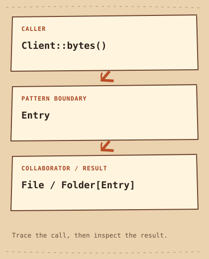

# Composite

[English](README.md) · [مصري](README.ar-EG.md) · [中文](README.zh-CN.md) · [Italiano](README.it.md)

[Precedente](../../structural/bridge/README.it.md) · [Categoria](../README.it.md) · [Successivo](../../structural/decorator/README.it.md)

[Percorso di studio](../../LEARNING_PATH.it.md) · [Scheda rapida](../../CHEATSHEET.it.md) · [Python](python/README.md) · [C++20](cpp/README.md)

## Category

[`Structural Pattern`](../../GLOSSARY.md#structural-pattern) — Un Design Pattern che organizza le relazioni fra object e class.

## Difficulty

Principiante

## In One Sentence

Tratta una foglia e un albero di object attraverso la stessa operazione.

## In parole semplici

Una cartella contiene file e altre cartelle.Composite offre `bytes` per entrambi, evitando al chiamante di gestire ogni livello.

## The Problem

Un browser deve calcolare i byte di file e cartelle annidate.

## Naive Solution

```cpp
int total = file_size;
for (int size : folder_sizes) total += size; // only one nesting level
```

## Why It Becomes a Problem

Cicli specifici per ogni profondità non reggono nuovi livelli e ripetono i controlli sul tipo.

## The Idea

File e Folder implementano Entry; la cartella chiede ricorsivamente i byte ai figli.

## Real-World Analogy

Una scatola contiene pacchi o altre scatole: il peso si calcola con la stessa regola.

## Structure

[Diagramma](diagram.md) · [Esegui l’esempio](cpp/README.md)



```text
Client::bytes()  -->  Entry  -->  File / Folder[Entry]
```

## Participants

Entry definisce bytes, File restituisce la dimensione, Folder possiede i figli con [`std::unique_ptr`](../../GLOSSARY.md#stdunique_ptr) e somma i risultati.

Ruoli canonici in questo esempio:

- [`Component`](../../GLOSSARY.md#component) — Il contratto comune esposto da foglie, gruppi o wrapper. Qui: `Entry`.
- [`Leaf`](../../GLOSSARY.md#leaf) — Un Component senza Component figli. Qui: `File`.
- [`ownership`](../../GLOSSARY.md#ownership) — La responsabilità di mantenere una risorsa valida e infine rilasciarla. Qui: `Folder::children_`.

## Python Example

Leggi prima il [piccolo esempio Python](python/README.md) e il [codice](python/main.py). Prevedi l’[output](python/expected.txt), poi esegui e modifica. Le note in inglese confrontano il progetto con C++20.

## Modern C++20 Example

```cpp
#include <iostream>
#include <memory>
#include <stdexcept>
#include <utility>
#include <vector>

struct Entry {
    virtual ~Entry() = default;
    virtual int bytes() const = 0;
};
class File final : public Entry {
    int size_;
public:
    explicit File(int size) : size_(size) {
        if (size < 0) throw std::invalid_argument("Negative size");
    }
    int bytes() const override { return size_; }
};
class Folder final : public Entry {
    std::vector<std::unique_ptr<Entry>> children_;
public:
    void add(std::unique_ptr<Entry> child) {
        if (!child) throw std::invalid_argument("Null child");
        children_.push_back(std::move(child));
    }
    int bytes() const override {
        int total = 0;
        for (const auto& child : children_) total += child->bytes();
        return total;
    }
};
int main() {
    auto images = std::make_unique<Folder>();
    images->add(std::make_unique<File>(20));
    Folder root;
    root.add(std::make_unique<File>(10));
    root.add(std::move(images));
    std::cout << "Total: " << root.bytes() << " bytes\n";
    std::cout << "Empty: " << Folder{}.bytes() << " bytes\n";
    try { const File invalid{-1}; }
    catch (const std::invalid_argument&) { std::cout << "Negative size rejected\n"; }
}
```

## Example Output

```text
Total: 30 bytes
Empty: 0 bytes
Negative size rejected
```

## When to Use

Usalo per veri alberi parte-tutto con un'operazione utile sia alle foglie sia ai gruppi.

### Use cases

Alberi di file, scene senza nodi condivisi e gerarchie di menu.

## When NOT to Use

Evitalo per liste piatte o grafi con condivisioni e cicli: l'ownership ad albero sarebbe scorretta.

## Advantages

Il client calcola un sottoalbero senza conoscerne profondità e forma.

## Trade-offs

Alberi profondi possono esaurire lo stack, le somme possono traboccare e le operazioni dei gruppi non vanno imposte alle foglie.

## Related Patterns

[Decorator](../decorator/README.it.md) · [Iterator](../../behavioral/iterator/README.it.md)

## Common Confusion

Decorator avvolge un object per aggiungere behavior; Composite riunisce figli per rappresentare un insieme.

## Terms to Remember

- `Composite` — Tratta una foglia e un albero di object attraverso la stessa operazione.
- `Component` — Il contratto comune esposto da foglie, gruppi o wrapper. Esempio: `Entry`.
- `Leaf` — Un Component senza Component figli. Esempio: `File`.
- `ownership` — La responsabilità di mantenere una risorsa valida e infine rilasciarla. Esempio: `Folder::children_`.

## Interview Vocabulary

- [`part-whole hierarchy`](../../GLOSSARY.md#part-whole-hierarchy) — Una struttura ricorsiva in cui gruppi contengono foglie o gruppi più piccoli.
- [`recursive composition`](../../GLOSSARY.md#recursive-composition) — Costruire ricorsivamente una struttura con parti che espongono il contratto dell'insieme.
- [`polymorphism`](../../GLOSSARY.md#polymorphism) — Usare un'interface con implementation diverse; C++ offre forme a runtime e a compile time.

## Interview Question

Perché add appartiene a Folder e non a Entry? Che significato avrebbe File.add?

## Mini Challenge

Aggiungi una cartella vuota e un livello annidato, verifica i totali e valuta un tipo numerico più ampio.

## Verifica cosa hai capito

1. Perché una Folder vuota può restituire zero con la stessa Interface di File?
2. Quando sarebbe più facile mantenere la soluzione semplice della pagina? Fai un esempio concreto.
3. Cambia un input dell’esempio Python. Prevedi l’output e spiega quale parte gestisce il cambiamento.

## Quick Summary

- **Problema:** Un browser deve calcolare i byte di file e cartelle annidate.
- **Soluzione:** File e Folder implementano Entry; la cartella chiede ricorsivamente i byte ai figli.
- **Trade-off:** Alberi profondi possono esaurire lo stack, le somme possono traboccare e le operazioni dei gruppi non vanno imposte alle foglie.
- **Da ricordare:** Il gruppo risponde come un elemento.

[Precedente](../../structural/bridge/README.it.md) · [Categoria](../README.it.md) · [Successivo](../../structural/decorator/README.it.md)
