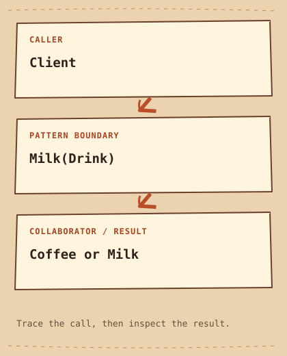

# المزيّن

[English](README.md) · [مصري](README.ar-EG.md) · [中文](README.zh-CN.md) · [Italiano](README.it.md)

[السابق](../../structural/composite/README.ar-EG.md) · [الفئة](../README.ar-EG.md) · [التالي](../../structural/facade/README.ar-EG.md)

## الفئة

التركيب

## المستوى

مبتدئ

## في جملة واحدة

ضيف سلوك بإنك تلف Object بواحدة تانية عندها نفس الواجهة.

## المشكلة

طلب القهوة ممكن يحتاج لبن مرة أو مرتين من غير Class لكل تركيبة.

## حل بسيط في الأول

```cpp
struct CoffeeWithMilk {};
struct CoffeeWithDoubleMilk {}; // another combination
```

## ليه الحل بيصعّب الدنيا

Classes التركيبات بتكرر السعر الأساسي، وعددها بيزيد مع كل إضافة.

## الفكرة الأساسية

Milk بتمتلك Drink وبتفوّض ليها قبل ما تضيف وصفها وسعرها.

## مثال من الحياة

كل طبقة تغليف بتحيط بالهدية اللي قبلها، ولسه الناتج هدية متغلفة.

## رسم توضيحي أصلي

[الرسم التوضيحي](diagram.md) · [شغّل المثال](cpp/README.md)



```text
Client  -->  Milk(Drink)  -->  Coffee or Milk
```

## الأدوار

Drink العقد المشترك، Coffee الأساس، وMilk بتلف Drink واحدة. الـ Client بيمتلك الطبقة الخارجية.

## C++20 — مثال كامل قابل للتشغيل

```cpp
#include <iostream>
#include <memory>
#include <stdexcept>
#include <string>
#include <utility>

struct Drink {
    virtual ~Drink() = default;
    virtual std::string description() const = 0;
    virtual int price() const = 0;
};
struct Coffee final : Drink {
    std::string description() const override { return "coffee"; }
    int price() const override { return 10; }
};
class Milk final : public Drink {
    std::unique_ptr<Drink> inner_;
public:
    explicit Milk(std::unique_ptr<Drink> inner) : inner_(std::move(inner)) {
        if (!inner_) throw std::invalid_argument("Missing drink");
    }
    std::string description() const override { return inner_->description() + " + milk"; }
    int price() const override { return inner_->price() + 2; }
};
int main() {
    std::unique_ptr<Drink> drink = std::make_unique<Coffee>();
    drink = std::make_unique<Milk>(std::move(drink));
    drink = std::make_unique<Milk>(std::move(drink));
    std::cout << drink->description() << ": " << drink->price() << '\n';
}
```

## الناتج المتوقع

```text
coffee + milk + milk: 14
```

## إمتى تستخدمه

استخدمه لسلوك اختياري قابل للتركيب وبيحافظ على عقد العنصر الأصلي.

## إمتى ما تستخدموش

بلاش لو قائمة مكونات وجمع أسعار كفاية؛ المثال متعمد عشان يوضح التركيب.

## المميزات

الإضافات بتتركب وقت التشغيل، والتنفيذ الأساسي بيفضل صغير.

## العيوب والمقايضات

ترتيب الطبقات ممكن يغيّر السلوك، وكتر الـ Objects الصغيرة بيصعّب التتبع. نفس الواجهة مش ضمان لنفس الوعود السلوكية.

## استخدامات تقنية

ينفع لطبقات ضغط وتشفير الـ Streams، مع الانتباه للترتيب والأخطاء.

## أنماط مرتبطة

[proxy](../proxy/README.ar-EG.md) · [composite](../composite/README.ar-EG.md)

## لخبطة شائعة

Proxy بتتحكم في الوصول، وDecorator بتضيف مسؤوليات؛ شكل الـ Wrapper لوحده مش كفاية تعرف المقصود.

## سؤال انترفيو

هل Logging قبل التشفير هيشوف نفس البيانات بعد التشفير؟

## تحدي صغير

ضيف Syrup بسعر 3 وجرّب ترتيبين، واشرح اختلاف الوصف.

## الخلاصة

- **المشكلة:** طلب القهوة ممكن يحتاج لبن مرة أو مرتين من غير Class لكل تركيبة.
- **الحل:** Milk بتمتلك Drink وبتفوّض ليها قبل ما تضيف وصفها وسعرها.
- **المقايضة:** ترتيب الطبقات ممكن يغيّر السلوك، وكتر الـ Objects الصغيرة بيصعّب التتبع. نفس الواجهة مش ضمان لنفس الوعود السلوكية.
- **افتكر:** نفس العقد، وطبقة زيادة.

[السابق](../../structural/composite/README.ar-EG.md) · [الفئة](../README.ar-EG.md) · [التالي](../../structural/facade/README.ar-EG.md)
