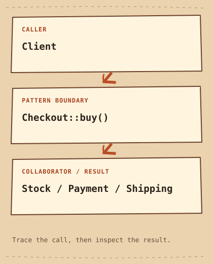

# الواجهة المبسّطة

[English](README.md) · [مصري](README.ar-EG.md) · [中文](README.zh-CN.md) · [Italiano](README.it.md)

[السابق](../../structural/decorator/README.ar-EG.md) · [الفئة](../README.ar-EG.md) · [التالي](../../structural/flyweight/README.ar-EG.md)

## الفئة

التركيب

## المستوى

مبتدئ

## في جملة واحدة

وفّر مدخل صغير لخطوات شائعة جوه Subsystem.

## المشكلة

كل مستدعي للشراء محتاج يراجع المخزون ويدفع ويطلب الشحن بالترتيب الصح.

## حل بسيط في الأول

```cpp
payment.charge(20);
shipping.dispatch(); // caller forgot to check stock
```

## ليه الحل بيصعّب الدنيا

الاستدعاءات المباشرة ممكن تنسى المخزون أو تكرر ترتيب الخطوات بشكل مختلف.

## الفكرة الأساسية

Checkout بتوفر buy وبتنسق الخدمات الداخلية ورا العملية دي.

## مثال من الحياة

استقبال المطعم بينسق الحجز بدل ما تكلم كل قسم.

## رسم توضيحي أصلي

[الرسم التوضيحي](diagram.md) · [شغّل المثال](cpp/README.md)



```text
Client  -->  Checkout::buy()  -->  Stock / Payment / Shipping
```

## الأدوار

Stock بتراجع التوفر، Payment بتحاسب، Shipping بتشحن، وCheckout بتعرض الخطوات المشتركة.

## C++20 — مثال كامل قابل للتشغيل

```cpp
#include <iostream>

struct Stock {
    bool available(int quantity) const { return quantity > 0 && quantity <= 3; }
};
struct Payment {
    void charge(int amount) const { std::cout << "Charged " << amount << '\n'; }
};
struct Shipping {
    void dispatch() const { std::cout << "Dispatched\n"; }
};
class Checkout {
    Stock stock_;
    Payment payment_;
    Shipping shipping_;
public:
    bool buy(int quantity) const {
        if (!stock_.available(quantity)) return false;
        payment_.charge(quantity * 10);
        shipping_.dispatch();
        return true;
    }
};
int main() {
    const Checkout checkout{};
    if (!checkout.buy(2)) return 1;
    if (!checkout.buy(4)) std::cout << "Unavailable\n";
}
```

## الناتج المتوقع

```text
Charged 20
Dispatched
Unavailable
```

## إمتى تستخدمه

استخدمه لما مستدعين كتير محتاجين نفس الجزء المفيد من نظام معقد.

## إمتى ما تستخدموش

بلاش لو مجرد تمرير لدالة من غير تبسيط حقيقي.

## المميزات

الـ Callers بيعتمدوا على واجهة أصغر وترتيب موحد.

## العيوب والمقايضات

الـ Facade ممكن تكبر وتعمل كل حاجة. المثال مش Transaction: فشل الدفع أو الشحن الحقيقي محتاج تعويض أو طريقة اتساق مناسبة.

## استخدامات تقنية

مناسب لمداخل SDK وحدود خدمات التطبيق؛ مفيش تكامل دفع حقيقي هنا.

## أنماط مرتبطة

[adapter](../adapter/README.ar-EG.md) · [mediator](../../behavioral/mediator/README.ar-EG.md)

## لخبطة شائعة

Adapter بتعالج التوافق. Facade بتصغّر واجهة النظام ومش لازم تنفذ واجهة موجودة.

## سؤال انترفيو

لو الدفع نجح والشحن فشل، buy تقدر توعد بإيه فعلاً؟

## تحدي صغير

ضيف فشل شحن تجريبي وصمّم نتيجة Refund واضحة بدل نجاح وهمي.

## الخلاصة

- **المشكلة:** كل مستدعي للشراء محتاج يراجع المخزون ويدفع ويطلب الشحن بالترتيب الصح.
- **الحل:** Checkout بتوفر buy وبتنسق الخدمات الداخلية ورا العملية دي.
- **المقايضة:** الـ Facade ممكن تكبر وتعمل كل حاجة. المثال مش Transaction: فشل الدفع أو الشحن الحقيقي محتاج تعويض أو طريقة اتساق مناسبة.
- **افتكر:** باب واحد لكذا خدمة.

[السابق](../../structural/decorator/README.ar-EG.md) · [الفئة](../README.ar-EG.md) · [التالي](../../structural/flyweight/README.ar-EG.md)
