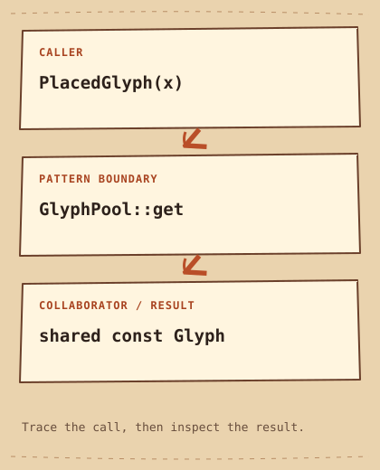

# Flyweight

[English](README.md) · [مصري](README.ar-EG.md) · [خطة التعلّم](../../LEARNING_PATH.ar-EG.md) · [Python](python/main.py) · [C++20](cpp/main.cpp)

**الفكرة في سطر:** شارك البيانات الثابتة، وخلي سياق كل ظهور منفصل.

## المشكلة

المستند فيه حروف مكررة كتير؛ تخزين شكل الحرف كامل لكل مكان بيهدر الذاكرة. نسخ نفس الشكل لكل ظهور بيخلّي الذاكرة تزيد بعدد المواضع بدل عدد الأشكال المختلفة.

## الحل ببساطة

نفس الحرف ممكن يظهر آلاف المرات في المستند.الـ`Flyweight` بيخزّن الشكل المشترك مرة واحدة، وكل ظهور بيحتفظ بمكانه لوحده. خزّن شكل الحرف `Glyph` مرة واحدة لكل مفتاح في مخزن مشترك (`pool`). كل ظهور، من نوع `PlacedGlyph`، بيشارك الشكل الثابت (`const Glyph`) وبيحتفظ بموضعه `x` لوحده.

الـ **interface** هو الاتفاق اللي الكود المستدعي متوقعه: هيستدعي إيه، وإيه النتيجة. المثال بيحط المسؤولية دي في مكان واضح بدل ما تتكرر في كل مكان.

## اقرأ الرسمة



```text
PlacedGlyph(x)  -->  GlyphPool::get  -->  shared const Glyph
```

في المثال، `Glyph` بتحتفظ بالشكل المشترك، و `GlyphPool` بتعيد استخدامه بدل تكراره. كل ظهور، ممثّل بنوع `PlacedGlyph`، بيحتفظ بموضعه وبيشارك ملكية الشكل. المقصود بـ [`ownership`](../../GLOSSARY.md#ownership) هنا هو مسؤولية إبقاء المورد موجود وتحريره في الآخر.

الأدوار القياسية في المثال ده:

- [`intrinsic state`](../../GLOSSARY.md#intrinsic-state) — بيانات مستقلة عن مكان الاستخدام، فالـ `Flyweight` تقدر تشاركها. هنا: `Glyph::shape`.
- [`extrinsic state`](../../GLOSSARY.md#extrinsic-state) — بيانات تخص كل استخدام وبتفضل بره الـ `Flyweight` المشتركة. هنا: `PlacedGlyph::x`.
- [`Flyweight Factory`](../../GLOSSARY.md#flyweight-factory) — جزء بيبحث بالمفتاح ويرجع `Flyweight` مشتركة. هنا: `GlyphPool`.

الأسهم بتوضح مسار المثال ده، مش كل تطبيق ممكن للـ pattern. [شرح الرسمة](diagram.md).

## امشِ مع الكود

ابدأ من `main` في C++ أو من آخر جزء في Python. تابع الدور اللي في نص الرسمة، وبعدين شوف الناتج. الكود الكامل موجود كمان في [ملف Python](python/main.py) و[ملف C++20](cpp/main.cpp).

## Python example

```python
from dataclasses import dataclass


@dataclass(frozen=True)
class Glyph:
    shape: str


class GlyphPool:
    def __init__(self):
        self.glyphs = {}

    def get(self, symbol):
        if symbol not in self.glyphs:
            self.glyphs[symbol] = Glyph(symbol)
        return self.glyphs[symbol]


class PlacedGlyph:
    def __init__(self, glyph, x):
        self.glyph = glyph
        self.x = x

    def draw(self):
        print(self.glyph.shape, "at", self.x)


if __name__ == "__main__":
    pool = GlyphPool()
    first = PlacedGlyph(pool.get("A"), 0)
    second = PlacedGlyph(pool.get("A"), 10)
    first.draw()
    second.draw()
    print("Shared shape:", first.glyph is second.glyph)
    print("Different shape:", first.glyph is pool.get("B"))
```

### Python output

```text
A at 0
A at 10
Shared shape: True
Different shape: False
```

## C++20 example

```cpp
#include <iostream>
#include <map>
#include <memory>
#include <string>
#include <utility>

struct Glyph {
    const std::string shape;
    explicit Glyph(std::string value) : shape(std::move(value)) {}
};
class GlyphPool {
    std::map<char, std::shared_ptr<const Glyph>> glyphs_;
public:
    std::shared_ptr<const Glyph> get(char symbol) {
        auto& glyph = glyphs_[symbol];
        if (!glyph) glyph = std::make_shared<const Glyph>(std::string(1, symbol));
        return glyph;
    }
};
struct PlacedGlyph {
    std::shared_ptr<const Glyph> glyph;
    int x;
    void draw() const { std::cout << glyph->shape << " at " << x << '\n'; }
};
int main() {
    GlyphPool pool;
    const PlacedGlyph first{pool.get('A'), 0};
    const PlacedGlyph second{pool.get('A'), 10};
    first.draw();
    second.draw();
    std::cout << "Shared shape: " << std::boolalpha << (first.glyph == second.glyph) << '\n';
}
```

### C++20 output

```text
A at 0
A at 10
Shared shape: true
```

## قارن اللغتين

A small frozen dataclass makes the shared Python Glyph immutable through normal attribute assignment. C++ uses `shared_ptr<const Glyph>`. Both pools keep entries alive. This demonstrates sharing, not measured memory savings; the pool itself has a cost.

الفكرة واحدة في المثالين، حتى لو تفاصيل اللغة والناتج اختلفت. اقرأ الناتجين قبل ما تغيّر أي قيمة.

## إمتى تستخدمه؟

استخدمه بعد قياس تكرار كبير لبيانات ثابتة بين `objects` كتير.

### Use cases

أشكال الحروف وتعريفات أرضية الألعاب والأسماء المتكررة مرشحين مناسبين لو القياس أكد ده.

**التكلفة:** المخزن المشترك (`pool`) بيحتفظ بالعناصر، والبحث في `map` ليه تكلفة. كمان [`std::shared_ptr`](../../GLOSSARY.md#stdshared_ptr) بتتابع الملكية المشتركة؛ الكائن بيتحرر لما آخر مرجع مالك يختفي. النص في المثال صغير، ومفيش قياس يثبت توفير ذاكرة هنا. الوصول للمخزن مش محمي من الاستخدام المتزامن.

## جرّب تجاوب

1. إيه البيانات اللي لازم تفضل بره الـ`Glyph` المشتركة، وليه؟
2. إمتى الحل البسيط في الصفحة يبقى أسهل في الصيانة؟ ادّي مثال محدد.
3. غيّر مُدخل واحد في مثال Python. توقّع الناتج واشرح أنهي جزء مسؤول عن التغيير.

**تجربة صغيرة:** ضيف معرف الخط للمفتاح، واتأكد إن المفاتيح المتساوية بتشارك والمختلفة لأ.

[كل الأنماط](../../README.ar-EG.md) · [المصطلحات](../../GLOSSARY.md) · [دليل Python](../../PYTHON_EXAMPLES.md) · [دليل C++20](../../CPP_EXAMPLES.md)
