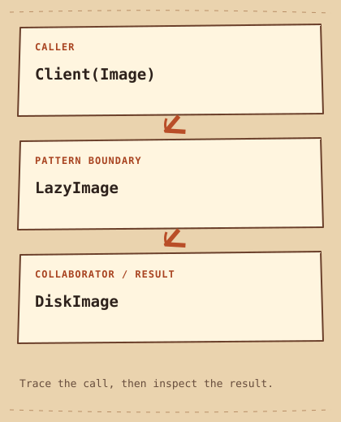

# Proxy

[English](README.md) · [مصري](README.ar-EG.md) · [中文](README.zh-CN.md) · [Italiano](README.it.md)

[上一个](../../structural/flyweight/README.zh-CN.md) · [类别](../README.zh-CN.md) · [下一个](../../behavioral/chain-of-responsibility/README.zh-CN.md)

## Category

[`Structural Pattern`](../../GLOSSARY.md#structural-pattern) — 关注 object 与 class 如何组织在一起的 Design Pattern。

## Difficulty

中级

## In One Sentence

通过相同 [`interface`](../../GLOSSARY.md#interface)（约定可调用的操作及其对外可观察行为） 的替身控制对真实 object 的访问。

## The Problem

图库可能准备很多图片，但只展示其中几张。

## Naive Solution

```cpp
DiskImage image; // loads even if never displayed
```

## Why It Becomes a Problem

立即创建所有重型图片，会在真正显示前做大量不必要的加载。

## The Idea

LazyImage 实现 Image，在第一次 display 时创建 DiskImage，之后复用。

## Real-World Analogy

图书申请单先代表库房里的书，需要时再由管理员取出。

## Structure

[结构图](diagram.md) · [运行示例](cpp/README.md)



```text
Client(Image)  -->  LazyImage  -->  DiskImage
```

## Participants

Image 是共同 interface，DiskImage 完成真实工作，LazyImage 拥有延迟创建的 object。

本例中的标准角色：

- [`Subject interface`](../../GLOSSARY.md#subject-interface) — Proxy 与 Real Subject 共同提供的约定。 对应代码： `Image`。
- [`Real Subject`](../../GLOSSARY.md#real-subject) — 在 Proxy 后面实际完成工作的 object。 对应代码： `DiskImage`。
- [`lazy initialization`](../../GLOSSARY.md#lazy-initialization) — 把创建推迟到首次需要值或资源时。 对应代码： `LazyImage::display`。

## Modern C++20 Example

```cpp
#include <iostream>
#include <memory>

struct Image {
    virtual ~Image() = default;
    virtual void display() const = 0;
};
struct DiskImage final : Image {
    DiskImage() { std::cout << "Load image\n"; }
    void display() const override { std::cout << "Display image\n"; }
};
class LazyImage final : public Image {
    mutable std::unique_ptr<DiskImage> image_;
public:
    void display() const override {
        if (!image_) image_ = std::make_unique<DiskImage>();
        image_->display();
    }
};
int main() {
    const LazyImage image;
    std::cout << "Proxy ready\n";
    image.display();
    image.display();
}
```

## Example Output

```text
Proxy ready
Load image
Display image
Display image
```

## When to Use

适合延迟初始化、访问检查或远程访问，同时希望保留稳定 interface 的场景。

### Use cases

可用于媒体延迟访问、授权入口和远程 object 桩，但失败语义各不相同。

## When NOT to Use

直接创建很便宜， access policy 也没有价值时，不必 Proxy。

## Advantages

Client 沿用 display interface，创建成本推迟到真正使用。

## Trade-offs

首次调用承担加载成本。mutable 表示逻辑常量性，不代表并发 display 安全；加载失败也需要明确的 policy。

## Related Patterns

[Decorator](../decorator/README.zh-CN.md) · [Adapter](../adapter/README.zh-CN.md)

## Common Confusion

Decorator 增加 behavior； Proxy 控制何时、是否访问目标， class diagram 可能相似。

## Terms to Remember

- `Proxy` — 通过相同 interface 的替身控制对真实 object 的访问。
- `Subject interface` — Proxy 与 Real Subject 共同提供的约定。 示例： `Image`。
- `Real Subject` — 在 Proxy 后面实际完成工作的 object。 示例： `DiskImage`。
- `lazy initialization` — 把创建推迟到首次需要值或资源时。 示例： `LazyImage::display`。

## Interview Vocabulary

- [`delegation`](../../GLOSSARY.md#delegation) — 一个 object 把部分工作交给协作方完成。
- [`runtime behavior`](../../GLOSSARY.md#runtime-behavior) — 程序执行时实际发生的动作，包括由运行时输入选择的 behavior。
- [`trade-off`](../../GLOSSARY.md#trade-off) — 获得一种好处时付出的另一种代价。

## Interview Question

加载抛出 exception 后，下次应重试还是保留失败 state？说明契约。

## Mini Challenge

连续显示三次统计加载次数，再加入首次失败的加载器测试 retry policy。

## Quick Summary

- **问题:** 图库可能准备很多图片，但只展示其中几张。
- **方案:** LazyImage 实现 Image，在第一次 display 时创建 DiskImage，之后复用。
- **权衡:** 首次调用承担加载成本。mutable 表示逻辑常量性，不代表并发 display 安全；加载失败也需要明确的 policy。
- **记忆提示:** 替身控制真实访问。

[上一个](../../structural/flyweight/README.zh-CN.md) · [类别](../README.zh-CN.md) · [下一个](../../behavioral/chain-of-responsibility/README.zh-CN.md)
